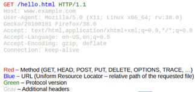
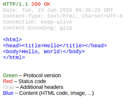
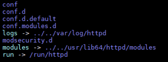
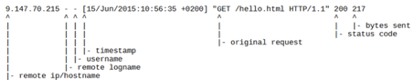
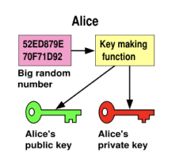
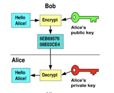
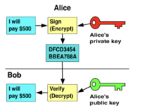
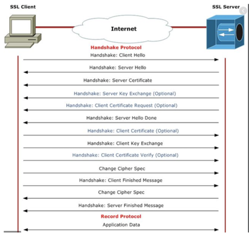

<p align="center">
  
</p>

# DevOps Academy - Lesson #3
## Important links
- [Apache HTTPD documentation](https://httpd.apache.org/docs/current/)
- [Security Headers (in czech)](https://securityheaders.cz)
- [Most important link](https://www.youtube.com/watch?v=dQw4w9WgXcQ)
- [SSL Labs](https://www.ssllabs.com/ssltest/)

## Goal & structure of this lesson
The main goal of this lesson is to get to know how webservers works with focus on Apache HTTPD, and look at some security issues with webservers like security headers and SSL/TLS.

We can break down the lesson to the following blocks:
 * **Introduction to the webservers and how they work [15m]**
 * **Introduction of Apache HTTPD [35m]**
 * *Break [10m]*
 * **Webservers + examples and practical parts [20m]**
 * **SSL/TLS [30m]**
 * *Break [10m]*
 * **Webserver security [40m]**
 * **Tips and tricks and questions [20m]**
 * 
 ## Web servers
Web servers are core for any web hosting, or even for any application operated in internet. Basically web server is a piece of software that uses HTTP protocol to serve files that create web pages to users in response to their request, which is sent by their client (browser, curl, ..). 

## Types of webservers
* Nginx
* Apache
* MS-IIS

## Apache
One of the most popular web server in the world developed by Apache Software Foundation. Apache is an open source piece of software which can be run on almost all operating systems (Linux,Unix,Windows,FreeBSD,OS X). First public release (version 0.6.2) was at April 1995 and at 2014 Apache was used to server 54% of websites on whole internet.
Right now latest version is 2.4.xy. Biggest power is easy customization using modules. Modules are also open source, so if you want to, you can contribute to this projects. In this course we will mainly focus on Apache.

* First public release (0.6.2) April 1995
* 2014 - 54% of WWW
* Latest version is 2.4
* HTTP/S
* Multiplatform and Open-source
* A patchy server
* Lots of modules
* Admin can help a lot to developers

## Nginx
Another free and open source web server. Nginx is known for its high performance, and low resource usage. First release (0.1.0) October 2004. And actual version is 1.19.2. It can use protocols as HTTP/S, SMTP, POP3, IMAP. Nginx was created as response to weird functionality of Apache module mod_accel. 

## How web servers works?
Web servers use mainly HTTP protocol to server requests and send reponses to user. So if web server recieve request it generates some response (from applicaton, static pages, pictures, …) and send it back to client, where client can be anybody or anything what can create HTTP requests like Browsers, applications (curl, wget,…).
Web servers not only can serve datas but can be used as proxy. So you can use webserver as proxy to internal network, or as middle man between client and you application. 

### HTTP request
<p align="center">
  
</p>

### HTTP response
<p align="center">
  
</p>

### HTTP status codes
* 1xx - Informational (<span style="color:blue">100 = Continue</span>)
* 2xx - Success (<span style="color:green">200 = OK</span>)
* 3xx - Redirection (<span style="color:blue">301 = Moved, 302 = Found, 304 = Not modified</span>)
* 4xx - Client error (<span style="color:red">401 = Not authorized, 403 = Forbidden, 404 = ?</span>)
* 5xx - Server error (<span style="color:red">500 = Internal error, 503 = Service unavailable</span>)

## Apache file structure
Fresh install usually look like this
<p align="center">
  
</p>

### /conf
In conf directory, there are configurations of core functionalities of Apache. Most important file here is httpd.conf which is the configuration file related to the server in itself. It’s configured as some default values, which we wil look at.

### User and Group
First directive is User and Group. This directive is for setting as which user Apache will run, because Apache starts as root, but then create child process which run as this user and group. Mainly it’s because of security reason, if attacker can hijack Apache process he won’t have full privileges as root, but as user Apache (or any different set by this directive).

> User apache
Group apache

### Directory
Directory directive is for setting up permissions and other thing about directory, apache have access to. Here we can grant access to specific users or IP addresses, set directory listable and so on. 

> <Directory "/var/www/html">
    &nbsp;&nbsp;&nbsp;&nbsp;&nbsp;&nbsp;&nbsp;&nbsp;Options Indexes FollowSymLinks
    &nbsp;&nbsp;&nbsp;&nbsp;&nbsp;&nbsp;&nbsp;&nbsp;AllowOverride None
    &nbsp;&nbsp;&nbsp;&nbsp;&nbsp;&nbsp;&nbsp;&nbsp;Require all granted
</Directory>

### LogFormat
This directive is for creating own formats of logs. It can be heavily changed there are more 40 options like time taken to server requests, query strings, client IP addresses and so on. More can be look at:

http://httpd.apache.org/docs/current/mod/mod_log_config.html

Best practice is to create own logformat, because its then easier to read and parse logs in some scripts or logs agregators (ELK). Also a good logformat can speed up proces of searching for errors.

> LogFormat "%h %l %u %t \"%r\" %>s %b \"%{Referer}i\" \"%{User-Agent}i\"" combined

<p align="center">
  
</p>

### /include and loading other configurations and modules
Last but not least important is include directive which is used for including other files to main configuration file httpd.conf. We can use it to load modules specific configurations, or configurations of own sites. 
Best practice is that in httpd.conf is main configuration about core of webserver (User and Group, LogFormat,..) and the rest of configuration is in other files.

> Include conf.modules.d/*.conf
IncludeOptional conf.d/*.conf

### Apache modules
Just a core functions of Apache are not enough for production use. So we must use modules. Modules can extend the core functionality a lot. Modules may be developer by Apache Software Foundtation, or from some third-party ( mod_auth_kerb – authentication for Kerberos is developer by Masaryk University)
Every module have unique directives and is loaded as dynamic shared object (*.so, *.dll). Usually modules are incompatible between major versions (1,2.). 
All modules are enable at all time when Apache is running, so it consumes more RAM, best practice is to use only that modules which you actually need.

* Authentication (Basic auth, LDAP,..)
* Resource protection (IP-based, certificate-based, ..)
* Directory behaviour (list directory, ..)
* Redirection, rewrite (rewrite/redirect rules,..)
* Aliases and header manipulation
* Security (TLS/SSL, WAF,..)
* Proxying
* CGI scripts

### /conf.d
In conf.d directory, there should be configurations for site specific things. Mainly there are configurations of virtualhosts, module configurations, ACL configurations. Best practice is to have all configurations ( except ACL and module specific) in single file = virtual.conf.

## Apache directives
We have a lot of options what we can setup in Apache. So now we will walk through some most used directives. 

### Directory scope
Applies on files and contexts. We can use wildcards and regexes. 
* Files <Files>, <FilesMatch>
* Directories <Directory>, <DirectoryMatch>
* Location URLs <Location>, <LocationMatch>

```sh
<Files "cat.html">
    # This would apply to cat.html.
</Files>

<Files "?at.*">
    # This would apply to cat.html, bat.html, hat.php and so on
</Files>

<FilesMatch ".+\.(gif|jpe?g|png)$">
    # This would apply to common image formats
</FilesMatch>
```

```sh
<Location "/dir/">
    # This would apply to http://www.mysite.com/dir/*
</Location>

<Directory "/var/web/dir1">
    <Files "private.html">
        # This would apply to all private.html files
        # in /var/web/dir1/ and its sub directories
        # eg. /var/web/dir1/somedir/private.html
    </Files>
</Directory>

<Directory "/var/web/dir1">
    <Directory "somedir">
        # will not work as <Directory> cannot nest
    </Directory>
</Directory>
```

### ServerRoot and DocumentRoot
We have two kind of directives for handling files, it’s resolving and prefix to locations. 

#### ServerRoot
* Main directory for relative path resolution
* Configs and logs 
* Must be absolute
* ServerRoot "/etc/httpd"
#### DocumentRoot
* Directory containing documents served via HTTP
* Can be absolute or relative to ServerRoot
* Virtualhosts = More than one 
* DocumentRoot /srv/test-engeto/htdocs/

### Listen 
Listen directis is for setting up on which port webserver will start listening and waiting for incoming connections. Usually it’s port 80 (http) and 443 (https).
> Listen 80
Listen 443

### Resource protection
As DevOps engneers you have a lot of power to help developers, if they make some mistakes. For example if they deploy some files (/test/ /.git/ .. ) into production. Resource protection is meant protecting locations on your web site, which may be accesible for everybody, or only for some specific IP addresses, or people with knowledge of basic authentication or client certificate. 

```sh
Reuqire all granted
Require all denied
```

### Virtual hosts – ip and port based
Virtual host sone of the most important directives. It can be used for serving multiple sites on the same IP address/Webserver. It can be IP and Port based, or in todays world most importantly NameBased (SNI).

```sh
Listen 80
Listen 172.20.30.40:8080

<VirtualHost *:80>
    DocumentRoot "/www/example1"
    ServerName example.com
</VirtualHost>

<VirtualHost 172.20.30.40:8080>
    DocumentRoot "/www/example2"
    ServerName example.com
    ServerAlias www.example.org w3.example.org
</VirtualHost>
```

## Virtual hosts – name based
If we want to have multiple sites with different hostname at same server (seznam.cz, api.seznam.cz, ..) we can use name based virtual hosts. There are two important new directives:
* ServerName - Hostname and port that the server uses to identify itself
* ServerAlias = Alternate names for a host used when matching requests to name-virtual hosts

```sh
Listen 80

<VirtualHost *:80>
    ServerName b2c.example.com
    ServerAlias www.example.org example.org
    
    DocumentRoot "/srv/www/htdocs/b2c"
    <Directory /srv/www/htdocs/b2c>
        Require all granted
    </Directory>
    
    ErrorLog /srv/www/logs/b2c-error.log
    CustomLog /srv/www/logs/b2c-access.log common
</VirtualHost>

<VirtualHost *:80>
    ServerName b22.example.com
    ...
</VirtualHost>
```

## Apache proxy module
Apache has a lot modules, and one of them is mod_proxy. It is used for creating reverse proxy connections in Apache. It can pass to different webserver (application listening and http port), or pass to script handlers or applications server (Apache Tomcat, JBoss,..) 

```sh
ProxyPass "/app" "http://app.example.com:8080/business"
ProxyPassReverse "/app" "http://app.example.com:8080/business"
```

Best practice is that, application server should not be directly connected to internet but instead it should be hidden behind some proxy which can be Apache. This can lead into a lot benefits, like access control (Resource protection,..) setting up certificates, logging acces and also protecting developers from their selfs. 

## SSL/TLS
### Public key cryptography
Or asymmetric cryptography, is a cryptographic system that uses pairs of keys: public keys, which may be distrubuted to anybody or let be accessible by anyone, and private keys, which are known and should be known only to the owner. The generation of such keys depends on cryptographic algorithms based on mathematical problems to produce one-way functions. So main security depends on private keys, and keeping them hidden. 

What is most interesting for us is SSL/TLS which is used for secret communication between client and webservers. It’s based on RSA (Rivest–Shamir–Adleman). If you want to get deeply into math and how RSA works you can look at: https://www.di-mgt.com.au/rsa_alg.html 

For our purposes we just need to know that there are two types of keys, public and private.

<p align="center">
  
</p>

So first one is encryption and decryption. It works that alice has two keys, public which she can send to anybody, or let it at her website. And private key which is used for decrypting messages encrypted with alice public key. 

<p align="center">
  
</p>

Another operation is digital signing. It work similarly as previous example. But it has different usage. Instead of encrypting message, alice want to prove something, for example she wrote a message that she will pay 500$ to Bob and sign (encrypt) it with her private key.  Then send message to bob with her public key and bob can verify that Alice wrote that message, because he can decrypt it with Alice’s public key. 

<p align="center">
  
</p>

So encryption/decryption is for hiding some message, but digital sign is for proving that someone own something (or created it).

## Certificate Authority (CA)
In cryptography, a certificate authority or certification authority (CA) is an entity that issues digital certificates. A digital certificate certifies the ownership of a public key by the named subject of the certificate. This allows others to rely upon signatures or on assertions made about the private key that corresponds to the certified public key. A CA acts as a trusted third party—trusted both by the subject (owner) of the certificate and by the party relying upon the certificate. The format of these certificates is specified by the X.509 or EMV standard.

Most common usage for certificate authorities is signing certificates which then will be used for HTTPS connections. Also for this course this is most important part for us. So what CA do is:

* Sign other certificates
* Maintain hierarchy
* Creates chain of trust

Usually when we get connected with certificate authorities is when we want to add support to HTTPS to our websites. First of all we generate keypair with some identifying informations as website name, owner and so on. Then we will generate certificate signing request (CSR) and send it to certificate authority. CA validates identity and with her own private key digitaly sign certificate request. With that anybody can validate that certificate is validated by some certificate authority, it’s same like before in example with Alice and Bob. After that applicant have all things he need to have to start using HTTPS on his website (own private key, public key/signed CSR).

## Apache nad SSL/TLS
Apache has module for supporting SSL/TLS which is called mod_ssl. It’s based on OpenSSL library and has a lot of directives as configuration of protocols, ciphers. Mod_ssl also support name-based virtualhosts with usage of SNI. 


SNI – Server Name Indication, it’s extension to TLS, where client indicates which hostname is attempting to connect at the start of handshake proces. This allows a server to present multiple certificates on the same IP address and TCP port number and hence allows multiple secure (HTTPS) websites (or any other service over TLS) to be served by the same IP address without requiring all those sites to use the same certificate.

```sh
Listen 443

SSLProtocol All -SSLv2 -SSLv3
SSLCipherSuite HIGH:MEDIUM:!MD5:!RC4

<VirtualHost *:443>
    ServerName b2c.example.com
    ServerAlias www.example.org example.org
    
    DocumentRoot "/srv/www/htdocs/b2c"
    <Directory /srv/www/htdocs/b2c>
        Require all granted
    </Directory>
    
    SSLEngine on
    SSLCertificateFile keys/b2c.crt
    SSLCertificateKeyFile keys/b2c.key
    
    ErrorLog /srv/www/logs/b2c-error.log
    CustomLog /srv/www/logs/b2c-access.log common
</VirtualHost>
```

At the example we can see that apache starts listening at port 443 (Default for HTTPS), and we are removing support for old SSL protocols SSLv2 and SSLv3, rest is allowed (All). Next thing are ciphersuites, where we removed MD5 and RC4.
Next things are inside virtualhost, first of all we need to start SSL, thats with directive SSLEngine on. Then we need to setup paths to our keypair, where SSLCertificateFile is path to public key (signed CSR) and SSLCertificateKeyFile is path to our private-key as we can see configuration use relative path which use ServerRoot directive. 

## SSL/TLS versions
* SSL 1.0 - don’t use 
* SSL 2.0 - don’t use
* SSL 3.0 - don’t use
* TLS 1.0 - don’t use
* TLS 1.1 - should not use
* TLS 1.2 - OK
* TLS 1.3 - OK

## SSL/TLS handshake
Before we move to next chapter, we should definitely focus on how SSL/TLS works. This part is probably most important. Read it carefully and try to understand every aspect of it. It can saves you a lot of time in future, or you dignity because you won’t send private keys to customers.

### One-way SSL/TLS handshake
1. First thing is that client tries to connect to some server (https://engeto.cz/). He send hello message that he want to start communicate. 
2. Server send response that he want to start communication and also send a Server Certificates
3. Client verify server certificates (check that it was signed with trusted certificate authority – usually publickeys of trusted certificate authorities are imported by default into browsers). If certificate is valid client generate pre-master secret and encrypt it with server certificate and send it back to server.
4. Server decrypt the message with own private key and get a pre-master secret. 
5. Both client and server generate session key based on premaster secret 
6. Then both client and server send finished message encrypted with session key. 
7. After that encrypted communication starts. 
### Two-way SSL/TLS handshake
1. First thing is that client tries to connect to some server (https://engeto.cz/). He send hello message that he want to start communicate. 
2. Server send response that he want to start communication and also send a Server Certificates and also sends a request for client certificate.
3. Client verify server certificates (check that it was signed with trusted certificate authority – usually publickeys of trusted certificate authorities are imported by default into browsers). If certificate is valid client generate pre-master secret and encrypt it with server certificate then digital sign it with own private-key (public key is known to server or is send with response) and send it back to server.
4. Server verify that user has client-certificate-private-key (decrypt with client public-key) decrypt the message with own private key and get a pre-master secret. Message must be digitaly signed with key-pair which is trusted for server. For example companies can generate key-pair and give it to client, which then use it for authentication to server.
5. Both client and server generate session key based on premaster secret 
6. Then both client and server send finished message encrypted with session key. 
7. After that encrypted communication starts. 

<p align="center">
  
</p>

## Let’s encrypt
Let’s Encrypt is a free, automated, and open certificate authority (CA), run for the public’s benefit. It is a service provided by the Internet Security Research Group (ISRG).  It’s for people or companies who want to use HTTPS but don’t want to spend money on different CA’s as DigitalSign and so on.

1. Free - Anyone who owns a domain name can use Let’s Encrypt to obtain a trusted certificate at zero cost.
2. Automatic - Software running on a web server can interact with Let’s Encrypt to painlessly obtain a certificate, securely configure it for use, and automatically take care of renewal.
3. Secure - Let’s Encrypt will serve as a platform for advancing TLS security best practices, both on the CA side and by helping site operators properly secure their servers.
4. Transparent - All certificates issued or revoked will be publicly recorded and available for anyone to inspect.
5. Open - The automatic issuance and renewal protocol will be published as an open standard that others can adopt.
6. Cooperative - Much like the underlying Internet protocols themselves, Let’s Encrypt is a joint effort to benefit the community, beyond the control of any one organization.

It’s pretty easy to get the certificates, you don’t even need to generate own private keys and csr’s. Automatization (scripts, apps) do this for you. You just need:

* Site need to be accessible from internet at port 80/TCP (http)
* Use some tool for automatic generation (https://github.com/acmesh-official/acme.sh)
* Example acme.sh: ./acme.sh --issue -d yoursite.com -w /path/to/htdocs

And if you will use Apache webserver you can again use mod for this which is mod_md (https://httpd.apache.org/docs/trunk/mod/mod_md.html) which supervise/renew TLS certificates via the ACME protocol. So if you want to have a secure website you just install it and configure by your requirements.

## Web server security
Web server security is important for any organization that has a physical or virtual Web server connected to the Internet. It requires a layered defense and is especially important for organizations with customer-facing websites.

Separate servers should be used for internal and external-facing applications and servers for external-facing applications should be hosted on a DMZ or containerized service network to prevent an attacker from exploiting a vulnerability to gain access to sensitive internal information. Best practice is  that web site security logs should be audited on a continuous basis and stored in a secure location.

### HTTP headers
When you visit a website, your browser sends a request to the web server to obtain data or information from it, e.g. an HTML file (i.e. a web page). Both in the request - the HTTP-Request – and in the server's response, some meta-information is exchanged in addition to the actual data.
It's name/value pair separated by a colon in HTTP request/response. Usually most of the security vulnerabilities can be fiex by implementing necessary headers in the reponse header. 
Http headers can be used to defense against attacks like clickjacking, code injection, xss, mime types, ..

#### HTTP Header X-XSS-Protection
* prevent some level of XSS (cross-site-scripting) attacks
* compatible with IE 8+, Chrome, Opera, Safari & Android
* Google, Facebook, Github use this header

##### Apache
* Header set X-XSS-Protection "1; mode=block"
##### Nginx
* add_header X-XSS-Protection "1; mode=block";

| Parameter Value | Meaning |
| ------ | ------ |
| 0 | XSS filter disabled |
| 1 | XSS filter enabled and sanitized the page if attack detected |
| 1;mode=block | XSS filter enabled and prevented rendering the page if attack detected |
| 1;report=http://example.com/report_URI | XSS filter enabled and reported the violation if attack detected |

#### HTTP Header HSTS

| Parameter Value | Meaning |
| ------ | ------ |
| 0 | XSS filter disabled |
| 1 | XSS filter enabled and sanitized the page if attack detected |
| 1;mode=block | XSS filter enabled and prevented rendering the page if attack detected |
| 1;report=http://example.com/report_URI | XSS filter enabled and reported the violation if attack detected |

#### HTTP Header X-Frame-Options

| Parameter Value | Meaning |
| ------ | ------ |
| 0 | XSS filter disabled |
| 1 | XSS filter enabled and sanitized the page if attack detected |
| 1;mode=block | XSS filter enabled and prevented rendering the page if attack detected |
| 1;report=http://example.com/report_URI | XSS filter enabled and reported the violation if attack detected |

#### HTTP Header X-Content-Type-Options

| Parameter Value | Meaning |
| ------ | ------ |
| 0 | XSS filter disabled |
| 1 | XSS filter enabled and sanitized the page if attack detected |
| 1;mode=block | XSS filter enabled and prevented rendering the page if attack detected |
| 1;report=http://example.com/report_URI | XSS filter enabled and reported the violation if attack detected |

#### HTTP Header Referrer-Policy

| Parameter Value | Meaning |
| ------ | ------ |
| 0 | XSS filter disabled |
| 1 | XSS filter enabled and sanitized the page if attack detected |
| 1;mode=block | XSS filter enabled and prevented rendering the page if attack detected |
| 1;report=http://example.com/report_URI | XSS filter enabled and reported the violation if attack detected |

#### HTTP Header CSP = Content security policy

| Parameter Value | Meaning |
| ------ | ------ |
| 0 | XSS filter disabled |
| 1 | XSS filter enabled and sanitized the page if attack detected |
| 1;mode=block | XSS filter enabled and prevented rendering the page if attack detected |
| 1;report=http://example.com/report_URI | XSS filter enabled and reported the violation if attack detected |


### ACL
### Apache SSLProtocol
### ProxyErrorOverride
### ModSecurity

## Tips & Tricks
* Backup backup backup - httpd.conf -> httpd.conf.20200908
* Webserver reload instead restart
* Always blacklist everything and allow only part of website 
* Create web server template (faster to create new servers, no mistake in security, etc..)
* Never send private key without password protection
* Create own log template with your needs
* Create manuals and script everything


