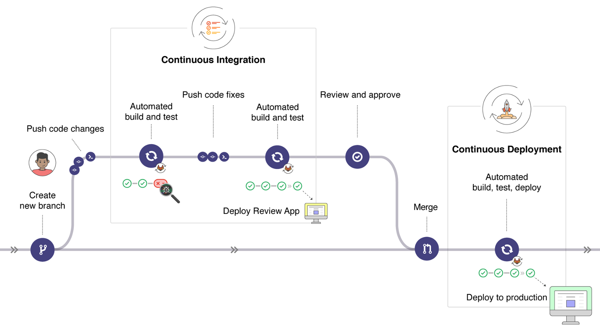

## Definition

See wiki https://en.wikipedia.org/wiki/CI/CD:

```
CI/CD bridges the gaps between development and operation activities and teams by enforcing automation in building,
testing and deployment of applications. 
```

Sounds like DevOps to me.

 * CI - continuous integration - In software engineering, continuous integration (CI) is the practice of merging
all developers' working copies to a shared mainline several times a day
 * CD - continuous delivery/deployment - Continuous delivery (CD) is a software engineering approach in which teams produce
software in short cycles, ensuring that the software can be reliably released at any time and,
when releasing the software, doing so manually. It aims at building, testing, and releasing software with greater
speed and frequency.

For further details, see https://www.guru99.com/continuous-integration-vs-delivery-vs-deployment.html

Example on reasonable short delivery cycle, compare following cases and decide which is better and why:

 * Developers prepare they changes and feature during a sprint. At the end of the sprint, they prepare large merge request
 and merge it into a production. Sprints are two weeks long
 * Developers prepare changes, test them in separate environments. Once the QA team is satisfied, feature are deployed into
 the production. This happens multiple times a day.

Consider the point of view from operations department.

## Consequences

 * Reduce costs: Using automation in the CI/CD pipeline helps reduce the number of errors that can take place
in the many repetitive steps of CI and CD.
 * Faster release rate: Failures are detected faster and as such, can be repaired faster, leading
to increasing release rates.
 * Fault isolations: Designing your system with CI/CD ensures that fault isolations are faster to
detect and easier to implement.
 * More test reliability: Using CI/CD, test reliability improves due to the bite-site and specific
changes introduced to the system, allowing for more accurate positive and negative tests to be
conducted.

Remember: it's not done by itself, CI/CD pipelines need to be created/programmed/stolen from somewhere. 

## Implementations of CI/CD Systems Examples

 * Jenkins:
    * The Continuous Delivery Foundation matured project,
    * Long history, forked from Hudson at 2011,
    * Back than created for Java apps,
    * Pipelines are written in Groovy,
      see https://www.jenkins.io/doc/pipeline/tour/hello-world/
 * Github Actions, Travis CI, Teamcity, Circle CI, ...
 * AWS CodeBuild as you've already seen in the second lecture
    * https://docs.aws.amazon.com/codebuild/latest/userguide/build-spec-ref.html
    * Phases are pre-defined
 * Gitlab CI:
    * Integrated to Gitlab itself, see https://about.gitlab.com/devops-tools/,
    * Pipelines written in YAML,
    * See https://about.gitlab.com/company/history/
    * The first release of Gitlab CI:
    https://gitlab.com/gitlab-org/gitlab-ci/commit/52cd500ee64a4a82b9ff6752ee85028cd419fcbe

Comparisons: 
 * https://en.wikipedia.org/wiki/Comparison_of_continuous_integration_software
 * https://www.digitalocean.com/community/tutorials/ci-cd-tools-comparison-jenkins-gitlab-ci-buildbot-drone-and-concourse
 * https://medium.com/devops-dudes/an-introduction-to-ci-with-comparison-of-17-major-ci-tools-in-2020-and-how-to-choose-the-best-ci-b0cc4ec4f95

## Let me go trough some GITory first

```
git init
touch .gitlab-ci.yml
git add .gitlab-ci.yml
git commit -m ...
```

For those who fancy UTF-8, le me show you `gitmoji`.

### GitFlow

Let's compare these two articles:

* https://nvie.com/posts/a-successful-git-branching-model/
* https://guides.github.com/introduction/flow/

GitFlow is mainly dedicated to a company or a project. Each could be different. For example, let's inspect
https://github.com/AckeeCZ/styleguide


 * What is the meaning of branches?
 * Why we use tags?
    * https://semver.org/spec/v2.0.0.html
    * https://keepachangelog.com/en/1.0.0/
 * What is the difference between pull request and merge request?

## Let's utilize our programming skills

See app https://yourbasic.org/golang/http-server-example/

```
package main

import (
    "fmt"
    "net/http"
)

func main() {
    http.HandleFunc("/", HelloServer)
    http.ListenAndServe(":8080", nil)
}

func HelloServer(w http.ResponseWriter, r *http.Request) {
    fmt.Fprintf(w, "Hello, %s!", r.URL.Path[1:])
}
```

Test app with `go run main.go` and `curl localhost:8080/world`

If you don't have golang installed, use Docker!

```
docker run -ti -v `pwd`:`pwd` -w `pwd` -p 8080:8080 golang sh
go run main.go
```

 * Why did we choose port 8080 for the web app?
 * Why golang?

## Visualization of a pipeline
<p align="center">
  
</p>

## Usual steps of a pipeline

 * build
 * test
 * [packaging]
 * deploy
 * [validation, canary, security checks, ...]
 
See https://www.redhat.com/en/topics/devops/what-cicd-pipeline for further explanation.

Where does our app fits into these steps?

 * build:
```
root@7c91f50e11d0:/home/nemo/slides/cicd/hello-app# go build
root@7c91f50e11d0:/home/nemo/slides/cicd/hello-app# ls
hello-app  main.go
```
 * test:
 let's just `curl` our application, golang unit tests optional
```
curl localhost:8080
```
 * packaging:
```
cd hello-app; docker build . -t beranm14/my-awesome-app:1.2.3
docker push beranm14/my-awesome-app:1.2.3
```
 * deployment:
```
kubectl set image deployment/my-awesome-app my-awesome-app=my-awesome-app:1.2.3 --record
kubectl rollout status deployment/my-awesome-app
```
