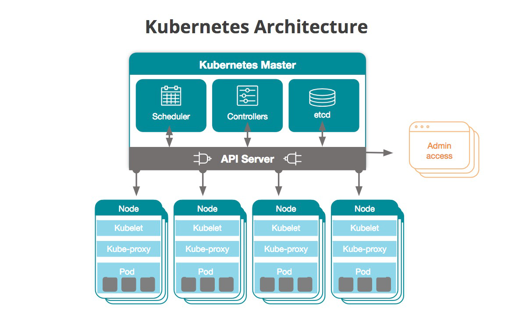

<style>{less: ../../../../main.less}</style>

<section class="navigation">
<a href="../../README.md" class="button is-small has-tooltip-bottom is-pulled-right" data-tooltip="Return to the Course Overview"><i class="fas fa-home"></i></a>
<div class="columns is-centered">
    <a href="./01-introduction.md" class="button is-small has-tooltip-bottom" data-tooltip="Previous"><i class="fas fa-arrow-left"></i></a>
    <a href="./03-k8s-api.md" class="button is-small has-tooltip-bottom" data-tooltip="Next"><i class="fas fa-arrow-right"></i></a>
</div>
</section>

# <a name="ch:kubernetes-cluster"></a> Kubernetes cluster

<section class="intro-section">

<!-- Intro -->

In order for you to get the most out of this course, it might be useful to <q>get your hands dirty</q> and try everything by yourself, instead of blindly reading through the lines without actually seeing the results. Therefore, we'll start by creating your very own Kubernetes mini-cluster (well, you can let yourself out of the leash, provision multiple hosts and spin up a whole rack, but that won't be necessary for the time being).

<article class="message is-primary">
<div class="message-header">
<i class="fas fa-2x fa-book-open"></i>
<span>Definition</span>
</div>
<div class="message-body" role="complementary" aria-label="definition">
<a name="def:kubernetes-cluster" aria-label="reference">
A Kubernetes cluster is a collection of master and worker nodes which communicate with each other.
</a>
</div>
</article>

To provision a cluster, you can choose one of the two approaches, which we'll further describe in this chapter &ndash; <b>single-node cluster</b> provisioning using [minikube] or <b>multi-node cluster</b> with [multipass] and [microk8s]. If you've passed the DevOps course, you should already be familiar with Virtual machines and `multipass`, so I would recommend choosing this approach (it is what I am going to choose for the rest of this course as well).

<table border="0" class="questions-table">
<tr><td class="question">
    <i class="fas fa-question-circle"></i>
    <span role="complementary" aria-label="question">
    What is a Kubernetes cluster?
    </span>
</td></tr>
<tr><td class="question">
    <i class="fas fa-question-circle"></i>
    <span role="complementary" aria-label="question">
    What is a Kubernetes control plane?
    </span>
</td></tr>
<tr><td class="question">
    <i class="fas fa-question-circle"></i>
    <span role="complementary" aria-label="question">
    What Kubernetes components can we find in the control plane?
    </span>
</td></tr>
<tr><td class="question">
    <i class="fas fa-question-circle"></i>
    <span role="complementary" aria-label="question">
    What is a Kubernetes master node? How many masters can a cluster have?
    </span>
</td></tr>
</table>

<table class="shortcuts-table">
<tr>
    <td>HA</td>
    <td>High Availability</td>
</tr>
</table>

</section>

## <a name="sec:provisioning"></a> Architecture

<center>

<div>
<a name="fig:kubernetes-architecture" role="figure" aria-label="reference">
<figcaption>Kubernetes: Architecture</figcaption>
</a>
</div>
</center>

The high-level overview of Kubernetes is depicted on the picture above. As you can see, it's not that complicated (of course, that's just the high level). There are just a few core Kubernetes components that take care of the cluster state.
We already know that a cluster is made up of *master* nodes and *worker* nodes. At least one of the machines is selected as the `master` and the remaining physical or virtual machines are called `worker nodes` or just `nodes`.

### Control plane

The Kubernetes control plane heavily employs events and the principle of loosely coupled components. Other distributed systems use remote procedure calls (RPCs) to trigger behaviour. Kubernetes does not. Kubernetes controllers watch changes to Kubernetes objects in the API server: adds, updates, and removes. When such an event happens, the controller executes its business logic <sup>[<a href="#ref:book/programming-kubernetes">Hausenblas (2019)</a>]</sup>.

Here is an example from the <i>Programming Kubernetes</i> book by . In order to launch a pod via a deployment, a number of controllers and other control plane components work together:
The deployment controller (inside of kube-controller-manager) notices (through a deployment informer) that the ”

Excerpt From: Michael Hausenblas. “Programming Kubernetes”. Apple Books.

<article class="message is-info">
<div class="message-header">
<i class="fas fa-2x fa-info-circle"></i>
<span>Note</span>
</div>
<div class="message-body" role="complementary" aria-label="note">
Get back to this section once you have deployed a Kubernetes cluster and check that the master node are running these services.
</div>
</article>

The Kubernetes master is the access point (or the **control plane**) from which administrators and other users interact with the cluster to manage the scheduling and deployment of containers. A cluster will always have at least one master, but may have more depending on the cluster’s replication pattern <sup>[<a href="#ref:blog/what-is-kubernetes">0</a>]</sup>. For example, if high availability is required, a cluster may have 3 or even 5 masters.
The core components of the control plane are **etcd**, **controller**, **scheduler** and **API server**.

Kubernetes manages the **state of the cluster**. The master stores the state and configuration data (like object manifests) for the entire cluster in [ectd], a persistent and distributed key-value data store. Each node has access to ectd (even though the host might not have its own replica of it) and through it, nodes learn how to maintain the configurations of the containers they’re running <sup>[<a href="#ref:blog/what-is-kubernetes">0</a>]</sup>. In HA setup, etcd is usually replicated across multiple nodes (or multiple masters).

Masters communicate with the rest of the cluster through the **kube-apiserver**, the main access point to the control plane. For example, the kube-apiserver makes sure that configurations in [etcd] match with configurations of containers deployed in the cluster. In the same way, a cluster admin manages the state of the cluster by communicating with the kube-apiserver (via `kubectl` tool or directly using kubernetes API).

The **kube-controller-manager** handles control loops that manage the state of the cluster via the Kubernetes API server. The Kubernetes controller manager is a daemon that embeds the core control loops shipped with Kubernetes. In applications of robotics and automation, a control loop is a non-terminating loop that regulates the state of the system. In Kubernetes, a controller is a control loop that watches the shared state of the cluster through the apiserver and makes changes attempting to move the current state towards the desired state. Examples of controllers that ship with Kubernetes today are the **replication controller**, **endpoints controller**, **namespace controller** or **serviceaccounts controller** <sup>[<a href="#ref:kube-controller-manager">1</a>]</sup>. We'll learn more about these Kubernetes objects later in this course.

Node workloads in the cluster are tracked and managed by the **kube-scheduler**. There might even be more schedulers in the cluster, each with dedicated workload and different **profiles** and **plugins**. This service keeps track of the capacity and resources of nodes and assigns work to nodes based on their availability.

### Worker node components

<article class="message is-info">
<div class="message-header">
<i class="fas fa-2x fa-info-circle"></i>
<span>Note</span>
</div>
<div class="message-body" role="complementary" aria-label="note">
Get back to this section once you have deployed a Kubernetes cluster and check that the worker nodes are running these services.
</div>
</article>

Each Kubernetes node runs an agent process called a [kubelet] that is responsible for managing the state of the node: starting, stopping, and maintaining application containers based on instructions from the control plane. The kubelet collects performance and health information from the node, pods and containers it runs and shares that information with the control plane to help it make scheduling decisions <sup>[<a href="#ref:blog/what-is-kubernetes">0</a>]</sup>. Kubelet also has the ability to communicate with containers running on the host (like accessing the base image layer etc.)

The last core component is the [kube-proxy].

## <a name="sec:provisioning"></a> Provisioning a cluster

To provision a Kubernetes cluster means to deploy Kubernetes components (i.e. the controller, sheduler, etcd or the apiserver) onto the machines that will be part of that cluster.

### <a name="subsec:single-node-cluster"></a> Provisioning a single-node cluster

Provisioning a single-node Kubernetes cluster with [minikube] is rather an easy task. Minikube itself can be easily installed on various platforms, follow the [installation documentation](https://kubernetes.io/docs/tasks/tools/install-minikube/) to install it on yours. As soon as [minikube] is successfully installed, spin up a single node cluster by issuing:

```
minikube start
```

<article class="message is-info">
<div class="message-header">
<i class="fas fa-2x fa-info-circle"></i>
<span>Note</span>
</div>
<div class="message-body" role="complementary" aria-label="note">
The `minikube start` command accepts various parameters that allows you to customize the provisioning and the cluster. These parameters include for example `--driver` which allows you to choose your virtualization provider (like `VirtualBox`, `VMware`, `hyperv` or even `docker`). It is also possible to use `none` and run the kubernetes comonents directly on the host. This has some implications and I definitely don't recommend doing that on your working machine. You can also select `--kubernetes-version` to be used, etc. Check out the [minikube] documentation for more examples.
</div>
</article>

The output should be similar to:

```
Starting local Kubernetes cluster...
Running pre-create checks...
Creating machine...
Starting local Kubernetes cluster...
```

And that's basically it. You should now be able to get the list of nodes (a single node) by running `kubectl get nodes`. What really happened when you issued that `kubectl` command is that you sent an API request to the Kubernetes API server which is running in a VM. If the command succeeded, the API server is up and running and your cluster has most likely been provisioned correctly.

### <a name="subsec:multi-node-cluster"></a> Provisioning a multi-node cluster

As we've shown in the course `Virtualization: Fundamentals`, spawning multiple VMs with `multipass` is a piece of cake. We're not going to get into the explanation again, for that, you either want to check out the virtualization course, or check out the [multipass] documentation.

The prerequisite is to have `3` VMs up and running.

<article class="message is-info">
<div class="message-header">
<i class="fas fa-2x fa-info-circle"></i>
<span>Note</span>
</div>
<div class="message-body" role="complementary" aria-label="note">
<code>3</code> isn't just a random magical number. The number of nodes (to be precise, nodes that are members of the `etcd` clsuter) should always be an <b>odd number</b>, so that they could reach a `quorum` during their vote. This will be explained further later in this course.
</div>
</article>

```
$ multipass list
Name                    State             IPv4             Image
k8s-1                   Running           192.168.64.2     Ubuntu 18.04 LTS
k8s-2                   Running           192.168.64.3     Ubuntu 18.04 LTS
k8s-3                   Running           192.168.64.4     Ubuntu 18.04 LTS
```

Next, we'll make use of our Ansible skills and write a playbook to setup our `microk8s` cluster. [microk8s] is a lightweight Kubernetes, pure upstream. It is being developed by Cannonical. The playbook along with the `inventory.ini` file has already been prepared for you and you can find it in the course files, but feel free to (at least try to) write your own.

From the ansible root directory, run the ansible playbook:

```
$ ansible-playbook -i intentory.ini playbook.yml
```

The playbook sets up `k8s-1` as a Kubernetes <b>master</b> and the remaining two hosts are Kubernetes worker nodes. If ran successfully, it has provisioned a lightweight Kubernetes cluster. Check that everything worked correctly:

```
$ multipass exec k8s-1 -- microk8s kubectl get nodes
NAME           STATUS   ROLES    AGE     VERSION
192.168.64.3   Ready    <none>   148m    v1.18.3-34+0c5dcc01175871
192.168.64.4   Ready    <none>   145m    v1.18.3-34+0c5dcc01175871
k8s-1          Ready    <none>   4h22m   v1.18.3-34+0c5dcc01175871
```

<article class="message is-info">
<div class="message-header">
<i class="fas fa-2x fa-info-circle"></i>
<span>Note</span>
</div>
<div class="message-body" role="complementary" aria-label="note">
If you attempt to run <code>kubectl</code> from your host machine directly instead of using the <code>multipass exec</code>, you'll notice that it doesn't work. It is required to set the <code>kubeconfig</code> first. We'll dig deeper into this in the following chapter, so don't worry about it now.
</div>
</article>


As we already know that the master should run all of the components of the control plane, let's see if that holds for the cluster that we provisioned.

On the master node, run:

```
$ netstat -tulpn | grep -E 'etcd|kube'
tcp        0      0 127.0.0.1:10248         0.0.0.0:*               LISTEN      5534/kubelet        
tcp        0      0 127.0.0.1:10249         0.0.0.0:*               LISTEN      15500/kube-proxy    
tcp        0      0 127.0.0.1:10251         0.0.0.0:*               LISTEN      22778/kube-schedule 
tcp        0      0 127.0.0.1:10252         0.0.0.0:*               LISTEN      18642/kube-controll 
tcp        0      0 127.0.0.1:2380          0.0.0.0:*               LISTEN      15589/etcd          
tcp        0      0 127.0.0.1:10256         0.0.0.0:*               LISTEN      15500/kube-proxy    
tcp6       0      0 :::10250                :::*                    LISTEN      5534/kubelet        
tcp6       0      0 :::10255                :::*                    LISTEN      5534/kubelet        
tcp6       0      0 :::10257                :::*                    LISTEN      18642/kube-controll 
tcp6       0      0 :::10259                :::*                    LISTEN      22778/kube-schedule 
tcp6       0      0 :::16443                :::*                    LISTEN      22951/kube-apiserve 
tcp6       0      0 :::12379                :::*                    LISTEN      15589/etcd
```

As you can see, there is `kube-controll` (the controller component), `kube-apiserve` (the API server), `etcd` and the `kube-schedule` (the scheduller) running and listening to the specified ports. Also, there is `kubelet` service as well. That shouldn't be surprising as the master node acts as a worker node as well.
`microk8s` runs these services as processess (service deamons). You can come across solutions which run them in containers as well, for example when deploying Kubernetes with [Kubespray](https://github.com/kubernetes-sigs/kubespray), which is a production-ready solution.


<br>

Now that you have a Kubernetes cluster up and running, you should be able to smoothly follow everything in this course.

<br>

## References

<a name="ref:blog/what-is-kubernetes"></a>Ali Gerrard (2019). <i>What is Kubernetes?</i>. Retrieved June 14, 2020, from <a href="https://blog.newrelic.com/engineering/what-is-kubernetes/">https://blog.newrelic.com/engineering/what-is-kubernetes/</a>

<a name="ref:docs/kubelet"></a>kubernetes.io (2020). <i>kube-controller-manager</i>. Retrieved June 14, 2020, from <a href="https://kubernetes.io/docs/reference/command-line-tools-reference/kube-controller-manager/">https://kubernetes.io/docs/reference/command-line-tools-reference/kube-controller-manager/</a>

<a name="ref:book/programming-kubernetes"></a>Hausenblas, M. and Schimanski, S. (2019). <i>Programming Kubernetes</i>. O'Reilly Media, Inc. ISBN: 9781492047100

<!-- -->

[etcd]: https://etcd.io
[minikube]: https://kubernetes.io/docs/setup/learning-environment/minikube/
[microk8s]: https://microk8s.io
[multipass]: https://multipass.run
[kubelet]: https://kubernetes.io/docs/reference/command-line-tools-reference/kubelet/
[kube-proxy]: https://kubernetes.io/docs/reference/command-line-tools-reference/kube-proxy/