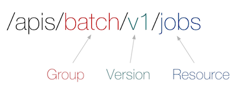
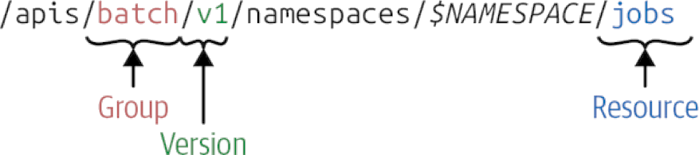
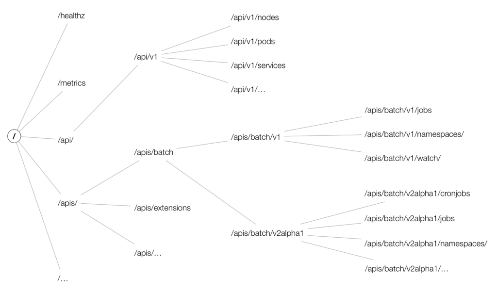

<style>{less: ../../../../main.less}</style>

<section class="navigation">
<a href="../../README.md" class="button is-small has-tooltip-bottom is-pulled-right" data-tooltip="Return to the Course Overview"><i class="fas fa-home"></i></a>
<div class="columns is-centered">
    <a href="./02-k8s-cluster.md" class="button is-small has-tooltip-bottom" data-tooltip="Previous"><i class="fas fa-arrow-left"></i></a>
    <a href="./04a-k8s-primitives.md" class="button is-small has-tooltip-bottom" data-tooltip="Next"><i class="fas fa-arrow-right"></i></a>
</div>
</section>

# <a name="ch:kubernetes-primitives"></a> Kubernetes API

<section class="intro-section">

<!-- Intro -->

Kubernetes is declarative. Basically anything in Kubernetes can be described as a **manifest**. The way users usually interact with Kubernetes is by creating such manifests and submitting them via `kubectl` CLI tool. This is a convenient, declarative way to interact with the Kubernets API. The manifests can be in JSON or YAML format.

<table border="0" class="questions-table">
<tr><td class="question">
    <i class="fas fa-question-circle"></i>
    <span role="complementary" aria-label="question">
    What is Kubernetes API server?
    </span>
</td></tr>
<tr><td class="question">
    <i class="fas fa-question-circle"></i>
    <span role="complementary" aria-label="question">
    What does <i>cohabition</i> mean in the context of Kubernetes? 
    </span>
</td></tr>
<tr><td class="question">
    <i class="fas fa-question-circle"></i>
    <span role="complementary" aria-label="question">
    How is a Kubernetes object identified within a cluster? 
    </span>
</td></tr>
<tr><td class="question">
    <i class="fas fa-question-circle"></i>
    <span role="complementary" aria-label="question">
    What is an API group?
    </span>
</td></tr>
<tr><td class="question">
    <i class="fas fa-question-circle"></i>
    <span role="complementary" aria-label="question">
    What API group do you know?
    </span>
</td></tr>
<tr><td class="question">
    <i class="fas fa-question-circle"></i>
    <span role="complementary" aria-label="question">
    Can you use resources with API version <code>v1alpha1</code>? What would be the implications?
    </span>
</td></tr>
</table>

<table class="shortcuts-table">
<tr>
    <td>GVR</td>
    <td>Group, Version, Resource</td>
</tr>
<tr>
    <td>GVK</td>
    <td>Group, Version, Kind</td>
</tr>
</table>

</section>

# <a name="ch:kubernetes-api"></a> Kubernetes API

<article class="message is-info">
<div class="message-header">
<i class="fas fa-2x fa-info-circle"></i>
<span>Note</span>
</div>
<div class="message-body" role="complementary" aria-label="note">
It might be tempting to skip this chapter, but please, give it at least a few minutes of your time. As a devops engineer, you should be aware of the lifecycle of the tools you're working with so that you could evaluate their stability and guarantee stable production environment.
</div>
</article>


The core of Kubernetes' control plane is the **API server**. The API server exposes an HTTP API that lets end-users, different parts of your cluster, and external components communicate with one another. The Kubernetes API lets you query and manipulate the state of objects in the Kubernetes API (for example: Pods, Namespaces, ConfigMaps, and Events) <sup>[<a href="#ref:k8s.io/api">0</a>]</sup>. If this component is down, your whole cluster is in serious trouble.

<article class="message is-info">
<div class="message-header">
<i class="fas fa-2x fa-info-circle"></i>
<span>Note</span>
</div>
<div class="message-body" role="complementary" aria-label="note">
Kubernetes has been changing rapidly so far. Therefore, there might be some API changes in Kubernetes manifest specifications. However, the so called <q>primitives</q> are core components of Kubernetes which are stable and will most likely not be subject to changes.
</div>
</article>


## <a name="sec:kubernetes-api/terminology"></a> Kubernetes API terminology

In the next chapter, we will take a look at Kubernetes primitives &ndash; Kubernetes core resources which are used to define the *desired state* (more on that later) and communicate it to the Kubernetes. In order for us to understand the specification of such resources, i.e. objects, it is useful to get familiar with the basic terminology.

<div class="subsection">

**Resource**

Let's start with the term which is most commonly used &ndash; *resource*. Resources are usually lowercase plurals, e. g. `pods`. They identify certain object types and their API endpoints. Typically, these endpoints then receive or return an object of a given `Kind` corresponding to that resource. Resources are always part of an API group.

An API Group, a Version and a Resource (GVR) uniquely defines a HTTP path <sup>[<a href="#ref:blog/kubernetes-deep-dive">3</a>]</sup>:

<center>

<div class="caption">
<a name="fig:kubernetes-gvr" role="figure" aria-label="reference">
<figcaption>Kubernetes GVR</figcaption>
</a>
</div>
</center>

The corresponding API path might look as such:

<center>

<div class="caption">
<a name="fig:kubernetes-resource-api-path" role="figure" aria-label="reference">
<figcaption>Figure: Kubernetes Resource API path</figcaption>
</a><sup>[<a href="#ref:books/programming-kubernetes">Hausenblas, 2019</a>]</sup>
</div>
</center>

Not all resources are **namespaced**, hence cluster resources, e. g. `ClusterRole`, wouldn't have the `/namespaces` part. 

<article class="message is-info">
<div class="message-header">
<i class="fas fa-2x fa-info-circle"></i>
<span>Note</span>
</div>
<div class="message-body" role="complementary" aria-label="note">
Try it yourself!

In order to send HTTP requests to the Kubernetes API (which is an HTTPS API), the easiest thing we can do is to create an HTTP proxy &ndash; `kubectl` has a built-in command for that:

```sh
kubectl proxy --port 8080
```

Now we should be able to send requests to the Kubernetes API. Check this by sending

```sh
curl -v http://localhost:8080/api
```

The output should list only the legacy API.

```json
{
  "kind": "APIVersions",
  "versions": [
    "v1"
  ],
  "serverAddressByClientCIDRs": [
    {
      "clientCIDR": "0.0.0.0/0",
      "serverAddress": "192.168.64.2:16443"
    }
  ]
}
```

To list API groups, let's issue `curl -v http://localhost:8080/apis`. The output should now be of `kind: APIGroupList`.

</div>
</article>

Most of the Kubernetes resources follow [API conventions](https://github.com/kubernetes/community/blob/master/contributors/devel/sig-architecture/api-conventions.md#resources). First, let's demonstrate the basic structure<sup class="has-tooltip-multiline" data-tooltip="We'll use golang for this purpose so that we could see the object types as they are defined in the Kubernetes golang API."><i class="fas fa-sm fa-question"></i></sup> on a `Pod` resource:

```go
import metav1 "k8s.io/apimachinery/pkg/apis/meta/v1"

// Pod is a collection of containers, used as either input (create, update) or as output (list, get).
type Pod struct {
	metav1.TypeMeta
	// +optional
	metav1.ObjectMeta

	// Spec defines the behavior of a pod.
	// +optional
	Spec PodSpec

	// Status represents the current information about a pod. This data may not be up
	// to date.
	// +optional
	Status PodStatus
}
```

Let's just for now take a look the the fields that are **common to all Kubernetes resources** &ndash; `metav1.TypeMeta` and `metav1.ObjectMeta`. They serve as unique identifiers and are therefore obligatory. `TypeMeta` constists of `Kind` and `APIVersion` and represents the type of the object and its API schema version. We'll learn more about `APIVersion`s in the <a href="sec/kubernetes-api/groups">Kubernetes API groups</a> section.

`TypeMeta` has the following [specification](https://github.com/kubernetes/apimachinery/blob/master/pkg/apis/meta/v1/types.go#L41):

```go
// TypeMeta describes an individual object in an API response or request
// with strings representing the type of the object and its API schema version.
// Structures that are versioned or persisted should inline TypeMeta.
//
// +k8s:deepcopy-gen=false
type TypeMeta struct {
	// Kind is a string value representing the REST resource this object represents.
	// Servers may infer this from the endpoint the client submits requests to.
	// Cannot be updated.
	// In CamelCase.
	// More info: https://git.k8s.io/community/contributors/devel/sig-architecture/api-conventions.md#types-kinds
	// +optional
	Kind string `json:"kind,omitempty" protobuf:"bytes,1,opt,name=kind"`

	// APIVersion defines the versioned schema of this representation of an object.
	// Servers should convert recognized schemas to the latest internal value, and
	// may reject unrecognized values.
	// More info: https://git.k8s.io/community/contributors/devel/sig-architecture/api-conventions.md#resources
	// +optional
	APIVersion string `json:"apiVersion,omitempty" protobuf:"bytes,2,opt,name=apiVersion"`
}
```

`ObjectMeta` consists of `name` of a resource and `namespace` where the resource resides. We'll learn more about `namespace`s later in this course, for now, however, you can understand it as simply a fraction or a logical segment of a cluster, usually dedicated to a user or a group of users. `ObjectMeta` also contains `labels` and `annotations` which can bare additional information about the object. Together, `APIVersion`, `Kind` and `Name` (and optionally a `namespace`) uniquely identify a resource within the cluster.

<article class="message is-info">
<div class="message-header">
<i class="fas fa-2x fa-info-circle"></i>
<span>Note</span>
</div>
<div class="message-body" role="complementary" aria-label="note">
It is often useful to consult the source code or the godoc when in doubt. The source code is well documented and often contains additional information about certain stanzas that are available on resources.
</div>
</article>

**Kind**

Kind is the type of an entity and it represents the entity within its API group. It is returned by and received by corresponding API endpoints.

<article class="message is-info">
<div class="message-header">
<i class="fas fa-2x fa-info-circle"></i>
<span>Note</span>
</div>
<div class="message-body" role="complementary" aria-label="note">
Resources and kinds are often mixed up. Note the clear distinction:
Resources correspond to HTTP paths.
Kinds are the types of objects returned by and received by these endpoints, as well as persisted into etcd.
</div>
</article>

It is often possible to devide `Kind`s into pseudo-categories <sup>[<a href="#ref:book/programming-kubernetes">Hausenblas, 2019</a>]</sup>:

<div class="subsubsection">

**Objects** represent a persistent entity in the system &ndash; for example, `Pod` or `Endpoint`s. Objects are uniquely identified by their names and most of them live in namespaces.

**Lists** are collections of one or more kinds of entities. Lists have a limited set of common metadata. Examples include `PodList` or `NodeList`. When you do a kubectl get pods, that’s exactly what you get.

**Special-purpose** kinds are used for specific actions on objects and for nonpersistent entities such as /binding or /scale. For discovery, Kubernetes uses APIGroup and APIResource; for error results, it uses Status.”

</div>

<article class="message is-primary">
<div class="message-header">
<i class="fas fa-2x fa-book-open"></i>
<span>Definition</span>
</div>
<div class="message-body" role="complementary" aria-label="definition">
<a name="def:kubernetes-api/terminology/kind" aria-label="reference">
<code>Kind</code> is the type of an entity.
</a>
</div>
</article>


**API Group**

Kubernetes implements API groups. The API group is specified in a REST path and in combination with the **version** in the `apiVersion` field of a serialized object.

<article class="message is-primary">
<div class="message-header">
<i class="fas fa-2x fa-book-open"></i>
<span>Definition</span>
</div>
<div class="message-body" role="complementary" aria-label="definition">
<a name="def:kubernetes-api/terminology/kind" aria-label="reference">
API group is a collection of Kinds that are logically related.
</a><sup>[<a href="#ref:book/programmin-kubernetes">Hausenblas, 2019</a>]</sup>
</div>
</article>

There are several API groups in a cluster:

<div class="content"><ul>
<li>

The **core** group, also referred to as the legacy group, is at the REST path /api/v1 and uses `apiVersion: v1`, it is often denoted as an empty string.

<article class="message is-info">
<div class="message-header">
<i class="fas fa-2x fa-info-circle"></i>
<span>Note</span>
</div>
<div class="message-body" role="complementary" aria-label="note">
Even though it is often denoted as empty string, i. e. <code>""</code>, we <b>NEVER</b> write <code>apiVersion: /v1</code>!
</div>
</article>

</li><li>

**Named** groups are at REST path `/apis/$GROUP_NAME/$VERSION`, and use `apiVersion: $GROUP_NAME/$VERSION` specification (e.g. `apiVersion: batch/v1`). The Kubernetes API reference has a full list of available API groups.

</li>
</ul></div> <!-- eof: content -->

It is also possible to extend the API with custom API group by using `CustomResourceDefinition` (or simply `CRD`) resources. We'll learn more about extending Kubernetes in the chapter dedicated to the topic.

As a common example, all **batch** objects like `Job` or `CronJob` are in the `batch` API group. A manifest of such Job` might look like this:

```yaml
apiVersion: batch/v1
kind: Job
metadata:
  name: pi
spec:
  REDACTED
```

Each API group can exist in multiple versions, and most of them do. For example, a group first appears as `v1alpha1` and is then promoted to `v1beta1` and finally graduates to `v1`. An object created in one version (e.g., `v1beta1`) <b>can be retrieved in each of the supported versions</b>.
The API server does lossless conversion to return objects in the requested version. From the cluster user’s point of view, versions are just different representations of the same objects. <sup>[<a href="#ref:book/programmin-kubernetes">Hausenblas, 2019</a>]</sup>

<article class="message is-info">
<div class="message-header">
<i class="fas fa-2x fa-info-circle"></i>
<span>Note</span>
</div>
<div class="message-body" role="complementary" aria-label="note">
There is no such thing as <q>one object is in <code>v1</code> in the cluster, and another object is in <code>v1beta1</code> in the cluster.</q> Instead, every object can be returned as a <code>v1</code> representation or in the <code>v1beta1</code> representation, as the cluster user desires.
</div>
</article>


**Cohabition**

Related to *resources* is the concept of *cohabition*. However terrifying it may sound, well... it actually is. What *cohabition* means is that at the same point in time, there might simultaniously exist resources in the cluster that are **of the same name, but a different *version* and even potentially different API group**.

<article class="message is-primary">
<div class="message-header">
<i class="fas fa-2x fa-book-open"></i>
<span>Definition</span>
</div>
<div class="message-body" role="complementary" aria-label="definition">
<a name="def:kubernetes-api/terminology/cohabition" aria-label="reference">
Resources of the same <code>Kind</code> may simultaniously exist in different versions and/or different API groups.
</a>
</div>
</article>

There are two typical examples to this phenomenon &ndash; the *core* group and the *extensions* group. For example, resource of type `Ingress` (explanation in the next chapter) exists in both `extensions` and `networking.k8s.io` APIs. If you don't believe me, check for yourself:

```
curl -v http://localhost:8080/apis/networking.k8s.io/v1beta1/ingresses
```
```json
{
  "kind": "IngressList",
  "apiVersion": "networking.k8s.io/v1beta1",
  "metadata": {
    "selfLink": "/apis/networking.k8s.io/v1beta1/ingresses",
    "resourceVersion": "6601"
  },
  "items": []
}
```

```
curl -v http://localhost:8080/apis/extensions/v1beta1/ingresses
```
```json
{
  "kind": "IngressList",
  "apiVersion": "extensions/v1beta1",
  "metadata": {
    "selfLink": "/apis/extensions/v1beta1/ingresses",
    "resourceVersion": "6687"
  },
  "items": []
}
```

Moreover, they have different `resourceVersion` as well.

<article class="message is-info">
<div class="message-header">
<i class="fas fa-2x fa-info-circle"></i>
<span>Note</span>
</div>
<div class="message-body" role="complementary" aria-label="note">
Note that the <code>items</code> is actually an empty list, but that only means that there are no resources of `kind: Ingress` in the cluster. It doesn't mean that the resource is not defined in the API group!
</div>
</article>

A part of the HTTP API space (based on v1.5) is shown in the following <sup>[<a href="#ref:blog/kubernetes-deep-dive/api-space">3</a>]</sup>:

<center>

<div class="caption">
<a name="fig:kubernetes-api-server-space" role="figure" aria-label="reference">
<figcaption>Kubernetes API server space (v1.5)</figcaption>
</a>
</div>
</center>

</div> <!-- eof: subsection -->

## <a name="sec:kubernetes-api/changes"></a> Kubernetes API versioning

Different API versions imply different levels of stability and support. The criteria for each level are described in more detail in the API Changes documentation. They are summarized here <sup>[<a href="#ref:k8s.io/api">0</a>]</sup>:

<div class="subsection">

**Alpha**

The version names contain alpha (e.g. `v1alpha1`, `v1alpha2`...).

Components may be buggy. Enabling the feature may expose bugs. This API is disabled by default.

Also, support for the feature may be dropped at any time without further notice. The API may change in incompatible ways in a later software release without notice (and it indeed does). It is recommended for use only in short-lived testing clusters, due to increased risk of bugs and lack of long-term support.

**Beta**

The version names contain beta (e.g. `v2beta3`).

The code is well tested and enabling the feature is considered safe. It is enabled by default.

Support for the overall feature will not be dropped, though details may change.
The schema and/or semantics of objects may change in incompatible ways in a subsequent beta or stable release. When this happens, we will provide instructions for migrating to the next version. This may require deleting, editing, and re-creating API objects. The editing process may require some thought. This may require downtime for applications that rely on the feature.

It is recommended for only non-business-critical uses because of potential for incompatible changes in subsequent releases. If you have multiple clusters which can be upgraded independently, you may be able to relax this restriction.
Please do try our beta features and give feedback on them! Once they exit beta, it may not be practical for us to make more changes.

**Stable**

The version name is `vX` where `X` is an integer, (e.g. `v1`).

Stable versions of features will appear in released software for many subsequent versions.

<article class="message is-info">
<div class="message-header">
<i class="fas fa-2x fa-info-circle"></i>
<span>Note</span>
</div>
<div class="message-body" role="complementary" aria-label="note">
The core group is located under <code>/api/v1</code> and not, as one would expect, under <code>/apis/core/v1</code>, for historic reasons. The core group existed before the concept of an API group was introduced <sup>[<a href="#ref:book/programmin-kubernetes">Hausenblas (2019)</a>]</sup>.
</div>
</article>

</div>

## <a name="sec:kubernetes-api/changes"></a> Kubernetes API changes

Any system that is successful needs to grow and change as new use cases emerge or existing ones change. Therefore, Kubernetes has design features to allow the Kubernetes API to continuously change and grow. The Kubernetes project aims to not break compatibility with existing clients, and to maintain that compatibility for a length of time so that other projects have an opportunity to adapt. In general, new API resources and new resource fields can be added often and frequently. Elimination of resources or fields requires following the API deprecation policy <sup>[<a href="#ref:k8s.io/api">0</a>]</sup>.

In practice, it is often a good idea to consult a [documentation](https://kubernetes.io/docs/reference/generated/kubernetes-api/v1.18/) before the actual implementation. Kubernetes community provide an increadible amount of resources to draw from. I would recommend the [official API reference](https://kubernetes.io/docs/reference/generated/kubernetes-api/v1.18/)<sup class="has-tooltip-multiline" data-tooltip="Make sure that you have correct Kubernetes version selected!"><i class="fas fa-sm fa-question"></i></sup> and the [go package documentation](https://pkg.go.dev/k8s.io/client-go/kubernetes?tab=doc) for a more in-depth insights.

<br>

## References

<!-- -->

<a name="ref:k8s.io/api"></a>Kubernetes (n. d.). <i>Kubernetes API</i>. Retrieved June 20, 2020, from <a href="https://kubernetes.io/docs/concepts/overview/kubernetes-api/">https://kubernetes.io/docs/concepts/overview/kubernetes-api/</a>

<a name="ref:k8s.io/community/api-conventions"></a>Kubernetes Community (n. d.). <i>Kubernetes API conventions</i>. Retrieved June 26, 2020, from <a href="https://github.com/kubernetes/community/blob/master/contributors/devel/sig-architecture/api-conventions.md#resources">https://github.com/kubernetes/community/blob/master/contributors/devel/sig-architecture/api-conventions.md#resources</a>

<a name="ref:blog/kubernetes-deep-dive/api-server"></a>Stefan Schimanski, Michael Hausenblas (2017)<i>Kubernetes deep dive: API Server - part 1</i>. Retrieved July 4, 2020, from <a href="https://www.openshift.com/blog/kubernetes-deep-dive-api-server-part-1">https://www.openshift.com/blog/kubernetes-deep-dive-api-server-part-1</a>

<a name="ref:book/programming-kubernetes"></a>Hausenblas, M. and Schimanski, S. (2019). <i>Programming Kubernetes</i>. O'Reilly Media, Inc. ISBN: 9781492047100
