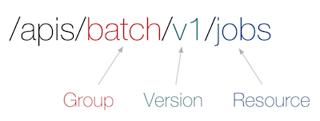
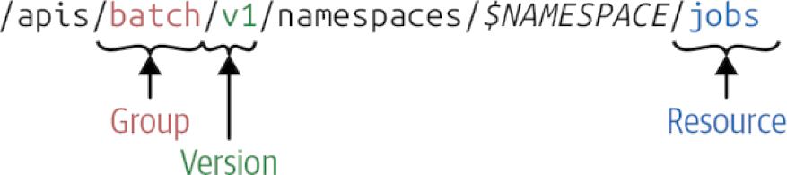

<style>{less: ../../../../main.less}</style>

# Kubernetes: Part I

This is additional material for your Kubernetes lesson. It's a workflow which presents you with the steps you can execute in order to follow the lessons closely and get your hands "dirty" as well.

## Prerequisites

### Master and worker nodes (VMs)

As we've shown in the course `Virtualization: Fundamentals`, spawning multiple VMs with `multipass` is a piece of cake. We're not going to get into the explanation again, for that, you either want to check out the virtualization course, or check out the [multipass] documentation.

The prerequisite is to have `3` VMs up and running (if your computer can't take it, it's okay, you can follow most of the content with 1 VM as well).

<article class="message is-info">
<div class="message-header">
<i class="fas fa-2x fa-info-circle"></i>
<span>Note</span>
</div>
<div class="message-body" role="complementary" aria-label="note">
<code>3</code> isn't just a random magical number. The number of nodes (to be precise, nodes that are members of the `etcd` clsuter) should always be an <b>odd number</b>, so that they could reach a `quorum` during their vote. This will be explained further later in this course.
</div>
</article>

The easy way to provision those VMs is via `multipass`, run the following command:

```
$ multipass launch --mem 2G --disk 5G --cpus 2  --name k8s-1
```

Additionally, if your computer can take it, create additional machines:

```
$ multipass launch --mem 2G --disk 5G --cpus 2  --name k8s-2
$ multipass launch --mem 2G --disk 5G --cpus 2  --name k8s-3
```

Now you may have something similar to this:

```
$ multipass list
Name                    State             IPv4             Image
k8s-1                   Running           192.168.64.2     Ubuntu 18.04 LTS
k8s-2                   Running           192.168.64.3     Ubuntu 18.04 LTS
k8s-3                   Running           192.168.64.4     Ubuntu 18.04 LTS
```

> Please, visit the Virtualization course materials for more information.

### `microk8s` cluster

Next, we'll make use of our Ansible skills and write a playbook to setup our `microk8s` cluster. [microk8s] is a lightweight Kubernetes, pure upstream. It is being developed by Canonical. The playbook along with the `inventory.ini` file has already been prepared for you and you can find it in the course files, but feel free to (at least try to) write your own.

From the ansible root directory, run the ansible playbook:

```
$ ansible-playbook -i intentory.ini playbook.yml
```

The playbook sets up `k8s-1` as a Kubernetes <b>master</b> and the remaining two hosts are Kubernetes worker nodes. If ran successfully, it has provisioned a lightweight Kubernetes cluster. Check that everything worked correctly:

```
$ multipass exec k8s-1 -- microk8s kubectl get nodes
NAME           STATUS   ROLES    AGE     VERSION
192.168.64.3   Ready    <none>   20m    v1.18.3-34+0c5dcc01175871
192.168.64.4   Ready    <none>   20m    v1.18.3-34+0c5dcc01175871
k8s-1          Ready    <none>   20m    v1.18.3-34+0c5dcc01175871
```

The `k8s-1` is your Kubernetes **master** node.

Finally, let's copy the **kubeconfig** from your master node to the local machine, so that you could sort of "remotely" manager the Kubernetes mini-cluster with the `kubectl` tool.

```
$ multipass exec k8s-1 -- sudo microk8s kubectl config view --raw > ~/.kube/config.microk8s
```

> NOTE: The `--raw` part is quite important, otherwise you'd end up with reducted certificates in the kubeconfig file.

As we already know that the master should run all of the components of the control plane, let's see if that holds for the cluster that we provisioned.

On the master node, run:

```
$ netstat -tulpn | grep -E 'etcd|kube'
tcp        0      0 127.0.0.1:10248         0.0.0.0:*               LISTEN      5534/kubelet        
tcp        0      0 127.0.0.1:10249         0.0.0.0:*               LISTEN      15500/kube-proxy    
tcp        0      0 127.0.0.1:10251         0.0.0.0:*               LISTEN      22778/kube-schedule 
tcp        0      0 127.0.0.1:10252         0.0.0.0:*               LISTEN      18642/kube-controll 
tcp        0      0 127.0.0.1:2380          0.0.0.0:*               LISTEN      15589/etcd          
tcp        0      0 127.0.0.1:10256         0.0.0.0:*               LISTEN      15500/kube-proxy    
tcp6       0      0 :::10250                :::*                    LISTEN      5534/kubelet        
tcp6       0      0 :::10255                :::*                    LISTEN      5534/kubelet        
tcp6       0      0 :::10257                :::*                    LISTEN      18642/kube-controll 
tcp6       0      0 :::10259                :::*                    LISTEN      22778/kube-schedule 
tcp6       0      0 :::16443                :::*                    LISTEN      22951/kube-apiserve 
tcp6       0      0 :::12379                :::*                    LISTEN      15589/etcd
```

As you can see, there is `kube-controll` (the controller component), `kube-apiserve` (the API server), `etcd` and the `kube-schedule` (the scheduller) running and listening to the specified ports. Also, there is `kubelet` service as well. That shouldn't be surprising as the master node acts as a worker node as well.
`microk8s` runs these services as processess (service deamons). You can come across solutions which run them in containers as well, for example when deploying Kubernetes with [Kubespray](https://github.com/kubernetes-sigs/kubespray), which is a production-ready solution.


### `kubectl` and `helm`

Install these two tools from their official websites if you want to stay up to date.

For `kubectl`: https://kubernetes.io/docs/tasks/tools/install-kubectl/

For `helm` (Helm 3): https://helm.sh/docs/intro/install/


## <a name="ch:kubernetes-api"></a> Kubernetes API terminology and operations

**Resource**

Let's start with the term which is most commonly used &ndash; *resource*. Resources are usually lowercase plurals, e. g. `pods`. They identify certain object types and their API endpoints. Typically, these endpoints then receive or return an object of a given `Kind` corresponding to that resource. Resources are always part of an API group.

An API Group, a Version and a Resource (GVR) uniquely defines a HTTP path <sup>[<a href="#ref:blog/kubernetes-deep-dive">3</a>]</sup>:

<center>

<div class="caption">
<a name="fig:kubernetes-gvr" role="figure" aria-label="reference">
<figcaption>Kubernetes GVR</figcaption>
</a>
</div>
</center>

The corresponding API path might look as such:

<center>

<div class="caption">
<a name="fig:kubernetes-resource-api-path" role="figure" aria-label="reference">
<figcaption>Figure: Kubernetes Resource API path</figcaption>
</a><sup>[<a href="#ref:books/programming-kubernetes">Hausenblas, 2019</a>]</sup>
</div>
</center>

In order to send HTTP requests to the Kubernetes API (which is an HTTPS API), the easiest thing we can do is to create an HTTP proxy &ndash; `kubectl` has a built-in command for that:

```sh
kubectl proxy --port 8080
```

Now we should be able to send requests to the Kubernetes API. Check this by sending

```sh
curl -v http://localhost:8080/api
```

The output should list only the legacy API.

```json
{
  "kind": "APIVersions",
  "versions": [
    "v1"
  ],
  "serverAddressByClientCIDRs": [
    {
      "clientCIDR": "0.0.0.0/0",
      "serverAddress": "192.168.64.2:16443"
    }
  ]
}
```

To list API groups, let's issue `curl -v http://localhost:8080/apis`. The output should now be of `kind: APIGroupList`.

Most of the Kubernetes resources follow [API conventions](https://github.com/kubernetes/community/blob/master/contributors/devel/sig-architecture/api-conventions.md#resources). First, let's demonstrate the basic structure<sup class="has-tooltip-multiline" data-tooltip="We'll use golang for this purpose so that we could see the object types as they are defined in the Kubernetes golang API."><i class="fas fa-sm fa-question"></i></sup> on a `Pod` resource:

```go
import metav1 "k8s.io/apimachinery/pkg/apis/meta/v1"

// Pod is a collection of containers, used as either input (create, update) or as output (list, get).
type Pod struct {
	metav1.TypeMeta
	// +optional
	metav1.ObjectMeta

	// Spec defines the behavior of a pod.
	// +optional
	Spec PodSpec

	// Status represents the current information about a pod. This data may not be up
	// to date.
	// +optional
	Status PodStatus
}
```

Let's just for now take a look the the fields that are **common to all Kubernetes resources** &ndash; `metav1.TypeMeta` and `metav1.ObjectMeta`. They serve as unique identifiers and are therefore obligatory. `TypeMeta` consists of `Kind` and `APIVersion` and represents the type of the object and its API schema version. We'll learn more about `APIVersion`s in the <a href="sec/kubernetes-api/groups">Kubernetes API groups</a> section.

`TypeMeta` has the following [specification](https://github.com/kubernetes/apimachinery/blob/master/pkg/apis/meta/v1/types.go#L41):

```go
// TypeMeta describes an individual object in an API response or request
// with strings representing the type of the object and its API schema version.
// Structures that are versioned or persisted should inline TypeMeta.
//
// +k8s:deepcopy-gen=false
type TypeMeta struct {
	// Kind is a string value representing the REST resource this object represents.
	// Servers may infer this from the endpoint the client submits requests to.
	// Cannot be updated.
	// In CamelCase.
	// More info: https://git.k8s.io/community/contributors/devel/sig-architecture/api-conventions.md#types-kinds
	// +optional
	Kind string `json:"kind,omitempty" protobuf:"bytes,1,opt,name=kind"`

	// APIVersion defines the versioned schema of this representation of an object.
	// Servers should convert recognized schemas to the latest internal value, and
	// may reject unrecognized values.
	// More info: https://git.k8s.io/community/contributors/devel/sig-architecture/api-conventions.md#resources
	// +optional
	APIVersion string `json:"apiVersion,omitempty" protobuf:"bytes,2,opt,name=apiVersion"`
}
```

`ObjectMeta` consists of `name` of a resource and `namespace` where the resource resides. We'll learn more about `namespace`s later in this course, for now, however, you can understand it as simply a fraction or a logical segment of a cluster, usually dedicated to a user or a group of users. `ObjectMeta` also contains `labels` and `annotations` which can bare additional information about the object. Together, `APIVersion`, `Kind` and `Name` (and optionally a `namespace`) uniquely identify a resource within the cluster.

<article class="message is-info">
<div class="message-header">
<i class="fas fa-2x fa-info-circle"></i>
<span>Note</span>
</div>
<div class="message-body" role="complementary" aria-label="note">
It is often useful to consult the source code or the godoc when in doubt. The source code is well documented and often contains additional information about certain stanzas that are available on resources.
</div>
</article>

**Kind**

Kind is the type of an entity and it represents the entity within its API group. It is returned by and received by corresponding API endpoints.

<article class="message is-info">
<div class="message-header">
<i class="fas fa-2x fa-info-circle"></i>
<span>Note</span>
</div>
<div class="message-body" role="complementary" aria-label="note">
Resources and kinds are often mixed up. Note the clear distinction:
Resources correspond to HTTP paths.
Kinds are the types of objects returned by and received by these endpoints, as well as persisted into etcd.
</div>
</article>

</div>

It is often possible to devide `Kind`s into pseudo-categories <sup>[<a href="#ref:book/programming-kubernetes">Hausenblas, 2019</a>]</sup>:

<div class="subsubsection">

**Objects** represent a persistent entity in the system &ndash; for example, `Pod` or `Endpoint`s. Objects are uniquely identified by their names and most of them live in namespaces.

**Lists** are collections of one or more kinds of entities. Lists have a limited set of common metadata. Examples include `PodList` or `NodeList`. When you do a `kubectl` get pods, that’s exactly what you get.

**Special-purpose** kinds are used for specific actions on objects and for nonpersistent entities such as /binding or /scale. For discovery, Kubernetes uses APIGroup and APIResource; for error results, it uses Status.”

</div>

<article class="message is-primary">
<div class="message-header">
<i class="fas fa-2x fa-book-open"></i>
<span>Definition</span>
</div>
<div class="message-body" role="complementary" aria-label="definition">
<a name="def:kubernetes-api/terminology/kind" aria-label="reference">
<code>Kind</code> is the type of an entity.
</a>
</div>
</article>


**API Group**

Kubernetes implements API groups. The API group is specified in a REST path and in combination with the **version** in the `apiVersion` field of a serialized object.

<article class="message is-primary">
<div class="message-header">
<i class="fas fa-2x fa-book-open"></i>
<span>Definition</span>
</div>
<div class="message-body" role="complementary" aria-label="definition">
<a name="def:kubernetes-api/terminology/kind" aria-label="reference">
API group is a collection of Kinds that are logically related.
</a><sup>[<a href="#ref:book/programmin-kubernetes">Hausenblas, 2019</a>]</sup>
</div>
</article>

There are several API groups in a cluster:

<div class="content"><ul>
<li>

The **core** group, also referred to as the legacy group, is at the REST path /api/v1 and uses `apiVersion: v1`, it is often denoted as an empty string.

<article class="message is-info">
<div class="message-header">
<i class="fas fa-2x fa-info-circle"></i>
<span>Note</span>
</div>
<div class="message-body" role="complementary" aria-label="note">
Even though it is often denoted as empty string, i. e. <code>""</code>, we <b>NEVER</b> write <code>apiVersion: /v1</code>!
</div>
</article>

</li><li>

**Named** groups are at REST path `/apis/$GROUP_NAME/$VERSION`, and use `apiVersion: $GROUP_NAME/$VERSION` specification (e.g. `apiVersion: batch/v1`). The Kubernetes API reference has a full list of available API groups.

</li>
</ul></div> <!-- eof: content -->

It is also possible to extend the API with a custom API group by using `CustomResourceDefinition` (or simply `CRD`) resources. We'll learn more about extending Kubernetes in the chapter dedicated to the topic.

As a common example, all **batch** objects like `Job` or `CronJob` are in the `batch` API group. A manifest of such Job` might look like this:

```yaml
apiVersion: batch/v1
kind: Job
metadata:
  name: pi
spec:
  REDACTED
```

Each API group can exist in multiple versions, and most of them do. For example, a group first appears as `v1alpha1` and is then promoted to `v1beta1` and finally graduates to `v1`. An object created in one version (e.g., `v1beta1`) <b>can be retrieved in each of the supported versions</b>.
The API server does lossless conversion to return objects in the requested version. From the cluster user’s point of view, versions are just different representations of the same objects. <sup>[<a href="#ref:book/programmin-kubernetes">Hausenblas, 2019</a>]</sup>

<article class="message is-info">
<div class="message-header">
<i class="fas fa-2x fa-info-circle"></i>
<span>Note</span>
</div>
<div class="message-body" role="complementary" aria-label="note">
There is no such thing as <q>one object is in <code>v1</code> in the cluster, and another object is in <code>v1beta1</code> in the cluster.</q> Instead, every object can be returned as a <code>v1</code> representation or in the <code>v1beta1</code> representation, as the cluster user desires.
</div>
</article>


**Cohabition**

Related to *resources* is the concept of *cohabition*. However terrifying it may sound, well... it actually is. What *cohabition* means is that at the same point in time, there might simultaneously exist resources in the cluster that are **of the same name, but a different *version* and even potentially different API group**.

<article class="message is-primary">
<div class="message-header">
<i class="fas fa-2x fa-book-open"></i>
<span>Definition</span>
</div>
<div class="message-body" role="complementary" aria-label="definition">
<a name="def:kubernetes-api/terminology/cohabition" aria-label="reference">
Resources of the same <code>Kind</code> may simultaniously exist in different versions and/or different API groups.
</a>
</div>
</article>

There are two typical examples to this phenomenon &ndash; the *core* group and the *extensions* group. For example, a resource of type `Ingress` (explanation in the next chapter) exists in both `extensions` and `networking.k8s.io` APIs. If you don't believe me, check for yourself:

```
curl -v http://localhost:8080/apis/networking.k8s.io/v1beta1/ingresses
```
```json
{
  "kind": "IngressList",
  "apiVersion": "networking.k8s.io/v1beta1",
  "metadata": {
    "selfLink": "/apis/networking.k8s.io/v1beta1/ingresses",
    "resourceVersion": "6601"
  },
  "items": []
}
```

```
curl -v http://localhost:8080/apis/extensions/v1beta1/ingresses
```
```json
{
  "kind": "IngressList",
  "apiVersion": "extensions/v1beta1",
  "metadata": {
    "selfLink": "/apis/extensions/v1beta1/ingresses",
    "resourceVersion": "6687"
  },
  "items": []
}
```

Moreover, they have different `resourceVersion` as well.

<article class="message is-info">
<div class="message-header">
<i class="fas fa-2x fa-info-circle"></i>
<span>Note</span>
</div>
<div class="message-body" role="complementary" aria-label="note">
Note that the <code>items</code> is actually an empty list, but that only means that there are no resources of `kind: Ingress` in the cluster. It doesn't mean that the resource is not defined in the API group!
</div>
</article>

A part of the HTTP API space (based on v1.5) is shown in the following <sup>[<a href="#ref:blog/kubernetes-deep-dive/api-space">3</a>]</sup>:

<center>

<div class="caption">
<a name="fig:kubernetes-api-server-space" role="figure" aria-label="reference">
<figcaption>Kubernetes API server space (v1.5)</figcaption>
</a>
</div>
</center>

</div> <!-- eof: subsection -->

### <a name="sec:kubernetes-api/versioning"></a> Kubernetes API versioning

Different API versions imply different levels of stability and support. The criteria for each level are described in more detail in the API Changes documentation. They are summarized here <sup>[<a href="#ref:k8s.io/api">0</a>]</sup>:

<div class="subsection">

**Alpha**

The version names contain alpha (e.g. `v1alpha1`, `v1alpha2`...).

Components may be buggy. Enabling the feature may expose bugs. This API is disabled by default.

Also, support for the feature may be dropped at any time without further notice. The API may change in incompatible ways in a later software release without notice (and it indeed does). It is recommended for use only in short-lived testing clusters, due to increased risk of bugs and lack of long-term support.

**Beta**

The version names contain beta (e.g. `v2beta3`).

The code is well tested and enabling the feature is considered safe. It is enabled by default.

Support for the overall feature will not be dropped, though details may change.
The schema and/or semantics of objects may change in incompatible ways in a subsequent beta or stable release. When this happens, we will provide instructions for migrating to the next version. This may require deleting, editing, and re-creating API objects. The editing process may require some thought. This may require downtime for applications that rely on the feature.

It is recommended for only non-business-critical uses because of potential for incompatible changes in subsequent releases. If you have multiple clusters which can be upgraded independently, you may be able to relax this restriction.
Please do try our beta features and give feedback on them! Once they exit beta, it may not be practical for us to make more changes.

**Stable**

The version name is `vX` where `X` is an integer, (e.g. `v1`).

Stable versions of features will appear in released software for many subsequent versions.

<article class="message is-info">
<div class="message-header">
<i class="fas fa-2x fa-info-circle"></i>
<span>Note</span>
</div>
<div class="message-body" role="complementary" aria-label="note">
The core group is located under <code>/api/v1</code> and not, as one would expect, under <code>/apis/core/v1</code>, for historic reasons. The core group existed before the concept of an API group was introduced <sup>[<a href="#ref:book/programmin-kubernetes">Hausenblas (2019)</a>]</sup>.
</div>
</article>

</div>

> TODO: Find examples of Kubernetes resources that are in `alpha`, `beta` and `v1` versions.

### <a name="sec:kubernetes-api/changes"></a> Kubernetes API changes

Any system that is successful needs to grow and change as new use cases emerge or existing ones change. Therefore, Kubernetes has design features to allow the Kubernetes API to continuously change and grow. The Kubernetes project aims to not break compatibility with existing clients, and to maintain that compatibility for a length of time so that other projects have an opportunity to adapt. In general, new API resources and new resource fields can be added often and frequently. Elimination of resources or fields requires following the API deprecation policy <sup>[<a href="#ref:k8s.io/api">0</a>]</sup>.

In practice, it is often a good idea to consult a [documentation](https://kubernetes.io/docs/reference/generated/kubernetes-api/v1.18/) before the actual implementation. Kubernetes community provide an increadible amount of resources to draw from. I would recommend the [official API reference](https://kubernetes.io/docs/reference/generated/kubernetes-api/v1.18/)<sup class="has-tooltip-multiline" data-tooltip="Make sure that you have correct Kubernetes version selected!"><i class="fas fa-sm fa-question"></i></sup> and the [go package documentation](https://pkg.go.dev/k8s.io/client-go/kubernetes?tab=doc) for a more in-depth insights.

<br>

## <a name="ch:kubernetes-primitives-introduction"></a> Kubernetes Primitives: Introduction

As we already know, Kubernetes is declarative. Basically anything in Kubernetes can be described as a **manifest**. The way users usually interact with Kubernetes is by creating such manifests and submitting them via `kubectl` CLI tool. This is a convenient, declarative way to interact with the Kubernetes API. The manifests can be in JSON or YAML format. `kubectl` interacts with the control plane, or more specifically, with the **Kubernetes API server**. Kubernetes controllers then watch for differences between the *desired* state and the current *observed* state of a resource. This is called **declarative state management**. In terms of Kubernetes, the desired state is the **spec** and the observed state is the **status**.

### <a name="sec:kubernetes-primitives/kubectl"></a> Setting up `kubectl`

In order for us to communicate with the cluster, we need to setup the `kubectl` tool properly. There is already a thorough [documentation](https://kubernetes.io/docs/tasks/tools/install-kubectl/) about how to install the `kubectl` tool, so I am not going to go through the installation in this text.
However, we will setup `kubectl` together, as it might get sort of tricky when running in a local setup with `multipass` and `microk8s` like we do.

So, to begin with, the source of truth for the `kubectl` tool is a **config** file, we call it **kubeconfig** and by default, it resides in `~/.kube/config`.

<article class="message is-info">
<div class="message-header">
<i class="fas fa-2x fa-info-circle"></i>
<span>Note</span>
</div>
<div class="message-body" role="complementary" aria-label="note">
There is also <code>KUBECONFIG</code> environment variable and <code>--kubeconfig</code> parameter to most of the Kubernetes components) which you can use to point to a specific config file.
</div>
</article>

As we've provisioned our cluster with `microk8s` and `multipass`, we need to retrieve the `kubectl` from the VM which is the Kubernetes **master**, that is `k8s-1`. As `microk8s` stores it in a different location, rather than searching for it (I can tell you where it is, but I am not going to spoil the fun in case you wanted to look for it), we can retrieve it by using `microk8s kubectl` command which is a proxy to the `kubectl`.

```
microk8s kubectl config view
```

```yaml
apiVersion: v1
clusters:
- cluster:
    certificate-authority-data: DATA+OMITTED
    server: https://127.0.0.1:16443
  name: microk8s-cluster
contexts:
- context:
    cluster: microk8s-cluster
    user: admin
  name: microk8s
current-context: microk8s
kind: Config
preferences: {}
users:
- name: admin
  user:
    token: "************************************************************"
```

You can retrieve it with the following command:

```
multipass exec k8s-1 -- microk8s kubectl config view --raw > ~/.kube/config.microk8s
```

The `--raw` parameter is important, otherwise the `certificate-authority-data` field would be redacted. Now, the last thing we have to do is to change the `server` url to the host ip. In my case, that would be `https://192.168.64.2:16443`.

Now just change the `KUBECONFIG` environment variable to point to the kubeconfig file. Verify that you've successfully setup `kubectl` by listing the nodes that you have in the cluster. You should see similar output:

```
$ kubectl get nodes
NAME           STATUS   ROLES    AGE   VERSION
192.168.64.3   Ready    <none>   29h   v1.18.5
192.168.64.4   Ready    <none>   29h   v1.18.5
k8s-1          Ready    <none>   29h   v1.18.5
```

That's it! You can now communicate with the Kubernetes API server via `kubectl`.

<article class="message is-info">
<div class="message-header">
<i class="fas fa-2x fa-info-circle"></i>
<span>Note</span>
</div>
<div class="message-body" role="complementary" aria-label="note">

<b>TIP: </b> Take a look at [oh-my-zsh kubectl plugin](https://github.com/ohmyzsh/ohmyzsh/blob/master/plugins/kubectl/kubectl.plugin.zsh) if you're using `zsh` (if not, I can only recommend that you do!). It makes working with `kubectl` so much more fun. E. g. the previous command to list nodes would be aliased simply to `kgno`.
</div>
</article>

### <a name="sec:kubernetes-primitives/namespace"></a> Kubernetes Primitives: Namespace

First of all, we need a `Namespace` to deploy the application to. A `Namespace` is a resource as any other. There are only a couple of namespaces by default and as a rule of thumb, you shouldn't mess with them very much unless you know what you're doing. The system namespace is called `kube-system` and it usually runs the vital Kubernetes components like **controllers**, **api-server** or **metrics-server**.

<article class="message is-info">
<div class="message-header">
<i class="fas fa-2x fa-info-circle"></i>
<span>Note</span>
</div>
<div class="message-body" role="complementary" aria-label="note">
<b>TIP:</b> Try to list the namespaces that are currently present in the cluster. You can do that by running `kubectl get namespaces` or `kgns` with the zsh plugin.
</div>
</article>

That being said, `KUBECONFIG` stores the current **context**, i. e. the cluster to communicate with and also the namespace. By default you're placed in the `default` namespace.

Let's create a new namespace called `engeto`.

```
kubectl create namespace engeto
```

and change the context

```
kubectl config set-context --current --namespace=engeto
```

<article class="message is-info">
<div class="message-header">
<i class="fas fa-2x fa-info-circle"></i>
<span>Note</span>
</div>
<div class="message-body" role="complementary" aria-label="note">
This command is really heavy to remember. With the zsh plugin, you would just type `kcn engeto`.
</div>
</article>

<article class="message is-info">
<div class="message-header">
<i class="fas fa-2x fa-info-circle"></i>
<span>Note</span>
</div>
<div class="message-body" role="complementary" aria-label="note">

<b>TIP:</b> I recommend using [k9s](https://k9scli.io) to visually explore your cluster, but you can also setup Kubernetes dashboard (`microk8s` provides an addon for it as well).
</div>
</article>
