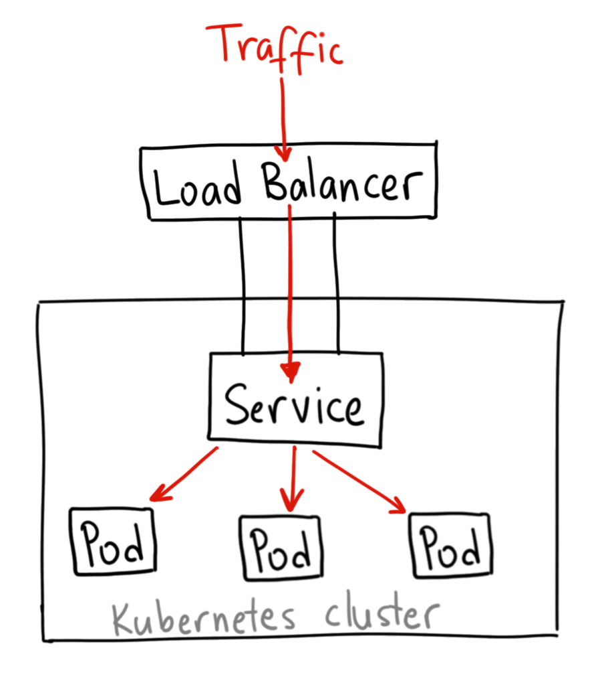

<style>{less: ../../../../main.less}</style>

# Kubernetes: Part II

This is the second part of your Kubernetes lesson. It's a workflow which presents you with the steps you can execute in order to follow the lessons closely and get your hands "dirty" as well. Make sure to check out Part I first in case you've skipped it!

## <a name="ch:kubernetes-primitives"></a> Kubernetes Primitives

In the previous lesson, we just briefly scratched the surface of Kubernetes primitives by introducing a namespace, the dedicated deployment space which we'll use to deploy our applications to. In this chapter, we'll further explore which primitives are available to us. You should be able to deploy and manage an application inside a Kubernetes cluster by the time you're done with this lesson.

### <a name="sec:kubernetes-primitives/application"></a> Application

Let's first describe the application that we're going to deploy into the cluster. We could probably find a hello-world application in the Kubernetes docs, but I am not a huge fan of these. Rather, let's write something simple ourselves so that we could modify it for our purposes later on the road.

There is a simple HTTP server written in go in the [app/](./app/) directory with a single root path `/`. Kubernetes is a container orchestration engine, hence it requires a containerized application. Let's create a [Dockerfile](./app/Dockerfile) for it, so that we could build an image.

Build that image and push it to a docker registry. I recommend a public one to begin with. Pulling images from a private registry a bit more complicated.

Now, running the echo server and hitting the endpoint simply with

```sh
curl -v localhost:8080
```

should give us a simple response:

```
Engeto: Kubernetes Example Application

Request received: &http.Request{Method:"GET", URL:(*url.URL)(0xc0000f2100), Proto:"HTTP/1.1", ProtoMajor:1, ProtoMinor:1, Header:http.Header{"Accept":[]string{"*/*"}, "User-Agent":[]string{"curl/7.64.1"}}, Body:http.noBody{}, GetBody:(func() (io.ReadCloser, error))(nil), ContentLength:0, TransferEncoding:[]string(nil), Close:false, Host:"localhost:8080", Form:url.Values(nil), PostForm:url.Values(nil), MultipartForm:(*multipart.Form)(nil), Trailer:http.Header(nil), RemoteAddr:"172.17.0.1:48238", RequestURI:"/", TLS:(*tls.ConnectionState)(nil), Cancel:(<-chan struct {})(nil), Response:(*http.Response)(nil), ctx:(*context.cancelCtx)(0xc0000ca3c0)}
```

Let's see how we can deploy the same application into Kubernetes.

### <a name="sec:kubernetes-primitives/deployment"></a> Kubernetes Primitives: Deployment

Let's get to the business and deploy our application. For that, we need to **create a `Deployment` resource** in the cluster.

The manifest of the `Deployment` could look like this:

```yaml
# file: deployment.yaml
apiVersion: apps/v1
kind: Deployment
metadata:
  labels:  # optional, but it's a good practice
    app: echoserver
  name: engeto-echoserver
  namespace: engeto  # optional, by default to the current namespace
spec:
  selector:
    matchLabels:
      app: echoserver
  template:
    metadata:
      labels:
        app: echoserver
    spec:
      containers:
      - name: main
        image: <namespace>/echoserver:latest  # make sure to provide your own docker namespace
```

This is about as simple as it gets. There is a bunch of additional stanzas we can use, but this is sufficient for the time being. So what did we do here?<br>
The resource is identified by its `apiVersion`, `kind` and `name`. It is a good practice to provide also the `app` label which is then common among multiple resources that are somewhat logically linked together. The `spec` then defines the `template` of a `Pod` which will be created. A `Pod` is a smallest deployable unit of computing that can be created and managed in Kubernetes. Each `Pod` has **at least** one container. `Pod`s are usually not created directly, but via `Deployments`, `DaemonSets` or `StatefulSets` (more on that in the <a href="#sec:kubernetes-primitives/others">last chapter</a>). A `Pod` has it's own `spec` which requires `containers` to be specified. Here, we provide the docker image with our application.

We can then submit that deployment to the cluster using the following command:

```
kubectl create -f deployment.yaml
```

<article class="message is-info">
<div class="message-header">
<i class="fas fa-2x fa-info-circle"></i>
<span>Note</span>
</div>
<div class="message-body" role="complementary" aria-label="note">
<b>TIP:</b> If you want to perform <code>kubectl apply</code> on this object in the future, it is useful to add `--safe-config` parameter to store the current configuration so that Kubernetes could apply the patch.
</div>
</article>

So, in a nutshell, when we submit a `Deployment`, it flows like this:

<ol>
<li><code>Deployment</code> is submitted via <code>kubectl create -f deployment.yaml</code></li>
<li>API server</li>
<li>deployment-controller</li>
<li>scheduler</li>
<li><code>Pod</code> is scheduled</code> on a <code>Node</code></ol>

Let's go ahead and create the `Deployment`. A `Pod` should have been created:

```
$ kubectl get pods -n engeto
NAME                                READY   STATUS    RESTARTS   AGE
engeto-echoserver-7d9b55884-bflbh   1/1     Running   0          15s
```

Now if we get the logs from the pod, or rather the container running in that pod, we should see the message that the echo serves is being served on port `8080`:

```
$ kubectl logs engeto-echoserver-7d9b55884-bflbh 
Serving Echo Server on: http://0.0.0.0:8080
```

#### <a name="subsec:kubernetes-primitives/deployment/customization"></a> Customizing a deployment

Very often we'd need to allow users of our applications to customize it to their needs. As we most likely don't want them to build their own images with custom parameters, like the `port` for example, there are two approaches how to handle that &ndash; either by using config files or environment variables.

For now, let's go with the latter. The application can read the `SERVER_HOST` and `SERVER_PORT` environment variables. The way we feed these to the `Deployment` is via `spec.template.spec.containers[].env[]`:

Try to modify that section with the following example:

```yaml
  ...
    containers:
    - name: main
      image: cermakm/echoserver:latest
      env:
      - name: SERVER_HOST
        value: "5000"
```

Check out the log again to verify that the server is running on the port `5000` now. We'll get to the second case &mdash; providing parameters via a configuration file &mdash; in the next section.

### <a name="sec:kubernetes-primitives/configmap-and-secrets"></a> Kubernetes Primitives: ConfigMaps and Secrets

`ConfigMap`s and `Secret`s are resources which store a configuration of an application.

### ConfigMaps

`ConfigMap`s are quite simple, they just store `data` as key=value pairs. An example of a `ConfigMap` which stores the `SERVER_HOST` and `SERVER_PORT` values:

```yaml
apiVersion: v1
kind: ConfigMap
metadata:
  name: echoserver-config
  labels:
    app: echoserver
data:
  host: "0.0.0.0"
  port: "5000"
```

There are three ways you would consume a `ConfigMap` in an application:

1. Using the value of a key as an environment variable
2. Load the whole `ConfigMap` into the environment
3. Mount the `ConfigMap` as a config file into the container

ad 1)

```yaml
  ...
    env:
    - name: SERVER_PORT
      valueFrom:
      configMapKeyRef:
        name: echoserver-config
        key: port
        optional: true  # start the container even if the key is missing
```

ad 2)

```yaml
  ...
    envFrom:
    - configMapRef:
        name: echoserver-config
```

<article class="message is-info">
<div class="message-header">
<i class="fas fa-2x fa-info-circle"></i>
<span>Note</span>
</div>
<div class="message-body" role="complementary" aria-label="note">
Note that in this case, the environment keys will be called <code>host</code> and <code>port</code>.
</div>
</article>


ad 3)

Consuming the `ConfigMap` as a volume is a little more complicated. We're going to talk about `Volume`s in a separate section, however, an example of such use case might look like this:

First, the `ConfigMap` itself would look a little bit different. Each key in the `ConfigMap` will be **mounted as a separate file** at the `mountPath`. Therefore, we would usually write something like this:

```yaml
apiVersion: v1
kind: ConfigMap
metadata:
  name: echoserver-config
  labels:
    app: echoserver
data:
  config.json: |-
    {
      "host": "0.0.0.0",
      "port": "5000"
    }
```

And then we could mount the `ConfigMap` as follows:

```yaml
  containers:
    - name: main
      ...
      volumeMounts:
      - name: config  # references the `volumes[].name`
        mountPath: /etc/echoserver/  # will result in a file /etc/echoserver/config.json
  volumes:
    - name: config
      configMap:
        name: echoserver-config
```

The application logic would of course need to be adjusted for such change. Feel free to do so!

### Secrets

In Kubernetes, `Secret`s let you store sensitive information, such as passwords, OAuth tokens, and ssh keys. Storing confidential information in a Secret is safer and more flexible than putting it verbatim in a Pod definition or in a container image <sup>[<a href="#ref:k8s.io/concepts/secrets">0</a>]</sup>. The primary reason being that the values stored in secrets are `base64` encoded, that is not really a safety measure (base64 is considered plain text), but it does at least prevents someone from beaing able to directly read a secret password.

A `Secret` might for example look as such:

```yaml
apiVersion: v1
kind: Secret
metadata:
  name: example-secret
type: Opaque
data:
  username: YWRtaW4=
  password: cGFzc3dvcmQ=
```

<article class="message is-info">
<div class="message-header">
<i class="fas fa-2x fa-info-circle"></i>
<span>Note</span>
</div>
<div class="message-body" role="complementary" aria-label="note">
To encode a the `username` used above into <code>base64</code> encoded string, issue <code>echo -n "admin" | base64</code>.
</div>
</article>

`Secret`s are quite similar to `ConfigMap`s and they are also consumed in a similar fashion, however, having these two configuration concepts devided has some advantages:

- Secrets are less verbatim
- Secrets have additional mechanisms that make their creation easier, i. e. `kubectl create secret` for reference.
- Logical differentiation between application configuration and secrets / credentials. This allows to control access to secrets in general as well by using native Kubernetes RBAC.

It's also necessary to list the risk that are associated with `Secrets` <sup>[<a href="#ref:k8s.io/concepts/secrets">0</a>]</sup>:

<div class="subsubsection">

- In the API server, secret data is stored in etcd ; therefore:

  - Administrators should enable encryption at rest for cluster data (requires v1.13 or later).
  - Administrators should limit access to etcd to admin users.
  - Administrators may want to wipe/shred disks used by etcd when no longer in use.

- If running etcd in a cluster, administrators should make sure to use SSL/TLS for etcd peer-to-peer communication.
- If you configure the secret through a manifest (JSON or YAML) file which has the secret data encoded as base64, sharing this file or checking it into a source repository means the secret is compromised. Base64 encoding is not an encryption method and is considered the same as plain text.

</div>

Applications still need to protect the value of secret after reading it from the volume, such as not accidentally logging it or transmitting it to an untrusted party. **A user who can create a Pod that uses a secret can also see the value of that secret**. Even if the API server policy does not allow that user to read the `Secret`, the user could run a Pod which exposes the secret. Currently, anyone with root permission on any node can read any secret from the API server, by impersonating the kubelet. It is a planned feature to only send secrets to nodes that actually require them, to restrict the impact of a root exploit on a single node.

<article class="message is-info">
<div class="message-header">
<i class="fas fa-2x fa-info-circle"></i>
<span>Note</span>
</div>
<div class="message-body" role="complementary" aria-label="note">
Have a look at solutions like <a href="https://www.vaultproject.io">Vault</a> from Hashicorp which allow to manage cluster secrets in a much safer way.
</div>
</article>

### <a name="sec:kubernetes-primitives/service"></a> Kubernetes Primitives: Services

Having a container running inside a Kubernetes cluster is a decent achievement, but in most cases, it's utterly useless, unlesss we can somehow interact with it and integrate it with other applications. By default, Kubernetes pods are **only accessible from within the cluster**. Each pod is assigned a unique cluster `IP` &mdash; which is a virtual IP &mdash; which identifies it within the cluster. However, in most cases we do want to expose these applications (like servers, microservices, controllers, UIs) to the outer world.

For example, let's take a look at the `Pod` resource of our sample application:

```
kubectl get pods -n engeto
```

There are multiple ways to expose the containers (or pods, to follow Kubernetes terminology more precisely) depending on the use case. To expose a process running inside a container basically means to expose the port of that container.

### Port forwarding

Let's start with the easiest one (but also, probably a completely useless one, at least for production purposes) &ndash; **port forwarding**. Port forwarding capability is provided by the `kubectl` tool via `kubectl port-forward` command. It is very similar to the `docker -p $HOST_PORT:$TARGET_PORT` command, which you should already be familiar with. The `port-forward` command creates a **proxy** to the container port and binds it to a localhost port.

This is sometimes useful for debugging purposes but you certainly don't want to use this in a production setting and you won't come across this very often (except for tutorials). Also, pods are mortal and if the pod that you're connected to dies, so does your connection.

### Services

Kubernetes `Service` is an abstract way to expose an application running on a set of Pods as a network service. In Kubernetes, a `Service` is an abstraction which defines a logical set of `Pods` and a policy by which to access them. For example, consider a stateless image-processing backend which is running with 3 replicas. Those replicas are fungible &mdash; frontends do not care which backend they use. While the actual Pods that compose the backend set may change, the frontend clients should not need to be aware of that, nor should they need to keep track of the set of backends themselves. The Service abstraction enables this decoupling. <sup>[<a href="#ref:k8s.io/concepts/services">1</a>]</sup>.

```yaml
apiVersion: v1
kind: Service
metadata:
  name: example-service
spec:
  selector:
    app: example-app
  ports:
    - protocol: TCP
      port: 8080
      targetPort: 9376
  type: ClusterIP
```

The `spec` of a `Service` is quite straightforward. There is a `selector` to map the service to an app, `ports` to choose ports that should be mapped and a `type`.


**Publishing Services (ServiceTypes)**

For some parts of your application (for example, frontends) you may want to expose a Service onto an external IP address, that's outside of your cluster.

Kubernetes ServiceTypes allow you to specify what kind of Service you want. The default is `ClusterIP`.

Type values and their behaviors are <sup>[<a href="#ref:k8s.io/concepts/services">1</a>]</sup>:

<div class="subsection">

`ClusterIP` exposes the Service on a cluster-internal IP. Choosing this value makes the Service only reachable from within the cluster. This is the default ServiceType.

<center>

<div class="caption">
<a name="fig:kubernetes-service-clusterip" role="figure" aria-label="reference">
<figcaption>Kubernetes Service: ClusterIP</figcaption>
</a>
<span class="has-text-weight-light is-size-7">Courtesy of <a href="https://medium.com/u/2cac56571879?source=post_page-----922f010849e0----------------------">Ahmet Alp Balkan</a></span>
</div>
</center>


`NodePort` exposes the Service on each Node's IP at a static port (the NodePort). A ClusterIP Service, to which the NodePort Service routes, is automatically created. You'll be able to contact the NodePort Service, from outside the cluster, by requesting <NodeIP>:<NodePort>.

<center>

<div class="caption">
<a name="fig:kubernetes-service-nodeport" role="figure" aria-label="reference">
<figcaption>Kubernetes Service: NodePort</figcaption>
</a>
<span class="has-text-weight-light is-size-7">Courtesy of <a href="https://medium.com/u/2cac56571879?source=post_page-----922f010849e0----------------------">Ahmet Alp Balkan</a></span>
</div>
</center>

`LoadBalancer` exposes the Service externally **using a cloud provider's load balancer**<sup class="has-tooltip-multiline" data-tooltip="In a bare-metal deployment, this can be handled for example with metallb"><i class="fas fa-sm fa-question"></i></sup>. NodePort and ClusterIP Services, to which the external load balancer routes, are automatically created.

<center>

<div class="caption">
<a name="fig:kubernetes-service-loadbalancer" role="figure" aria-label="reference">
<figcaption>Kubernetes Service: LoadBalancer</figcaption>
</a>
<span class="has-text-weight-light is-size-7">Courtesy of <a href="https://medium.com/u/2cac56571879?source=post_page-----922f010849e0----------------------">Ahmet Alp Balkan</a></span>
</div>
</center>

`ExternalName` maps the Service to the contents of the externalName field (e.g. foo.bar.example.com), by returning a CNAME record with its value. No proxying of any kind is set up. This is quite uncommon and in most cases, you won't probably meet with this type of service.

</div>

<article class="message is-info">
<div class="message-header">
<i class="fas fa-2x fa-info-circle"></i>
<span>Note</span>
</div>
<div class="message-body" role="complementary" aria-label="note">
Note: You need either kube-dns version 1.7 or CoreDNS version 0.0.8 or higher to use the ExternalName type.
</div>
</article>

You can also use `Ingress` to expose your `Service`. `Ingress` is not a `Service` type, but it acts as the entry point for your cluster. It lets you consolidate your routing rules into a single resource as it can expose multiple services under the same IP address. We'll discuss `Ingress` in the next section.

Let's create a service for our example application. As we haven't got a load balancer service deployed in the cluster, we're basically limited to `NodePort` and `ClusterIP`. Let's first try out the default `ClusterIP` type to see how it behaves.

```yaml
apiVersion: v1
kind: Service
metadata:
  name: echoserver  # it is good practice to use the same name for both service and application
spec:
  selector:
    app: echoserver
  ports:
    - protocol: TCP
      port: 8080
      targetPort: 5000  # make sure to use the correct port, remember, we've configured it via `ConfigMap`
  type: ClusterIP
```

Now, if we curl the Cluster IP address from our localhost, it won't work. We need to ssh to a node in the cluster and send the request from there.

```sh
curl -v <ClusterIP>:8080
```

That might not be the desired solution. What we can do then is to change the `type` to `NodePort`. Try it out for yourself and try to access the service using the host IP (as assigned by `multipass`).

### <a name="sec:kubernetes-primitives/ingress"></a> Kubernetes Primitives: Ingress

`Ingress` exposes HTTP and HTTPS routes from outside the cluster to services within the cluster. Traffic routing is controlled by rules defined on the Ingress resource <sup>[<a href="#ref:https://kubernetes.io/docs/concepts/services-networking/ingress/">2</a>]</sup>. Ingresses are a bit more complicated, they can also provide load balancing and SSL / TLS and they require an **ingress controller**.

<center>

<div class="caption">
<a name="fig:kubernetes-ingress" role="figure" aria-label="reference">
<figcaption>Kubernetes Ingress</figcaption>
</a>
<span class="has-text-weight-light is-size-7">Courtesy of <a href="https://medium.com/u/2cac56571879?source=post_page-----922f010849e0----------------------">Ahmet Alp Balkan</a></span>
</div>
</center>

A minimal Ingress resource example:

```yaml
apiVersion: networking.k8s.io/v1beta1
kind: Ingress
metadata:
  name: test-ingress
  annotations:
    nginx.ingress.kubernetes.io/rewrite-target: /
spec:
  rules:
  - http:
      paths:
      - path: /testpath
        pathType: Prefix
        backend:
          serviceName: test
          servicePort: 80
```

Ingress can also specify a `host` to provide named based virtual hosting, i.e.:

```
foo.bar.com --|                 |-> foo.bar.com service1:80
              | 178.91.123.132  |
bar.foo.com --|                 |-> bar.foo.com service2:80
```

which matches the following manifest:

```yaml
apiVersion: networking.k8s.io/v1beta1
kind: Ingress
metadata:
  name: name-virtual-host-ingress
spec:
  rules:
  - host: foo.bar.com
    http:
      paths:
      - backend:
          serviceName: service1
          servicePort: 80
  - host: bar.foo.com
    http:
      paths:
      - backend:
          serviceName: service2
          servicePort: 80
```

Ingresses are quite complicated and we certainly did not cover all of it in this section. I recommend checking out the [official documentation](https://kubernetes.io/docs/concepts/services-networking/ingress/) to learn more about them.

### <a name="sec:kubernetes-primitives/volumes"></a> Kubernetes Primitives: Volumes and PVCs

Now, let's head back to the scenario with the `echoserver` application. Say we want to store some kind of data to a **persistent volume**, for example to log each request that comes to the server or on the contrary, load an existing data to a running application. We want to create a `PersistentVolume` for that.

```yaml
# example: https://kubernetes.io/docs/concepts/storage/persistent-volumes/#persistent-volumes
apiVersion: v1
kind: PersistentVolume
metadata:
  name: pv0003
spec:
  capacity:
    storage: 5Gi
  volumeMode: Filesystem
  accessModes:
    - ReadWriteOnce
  persistentVolumeReclaimPolicy: Recycle
  storageClassName: slow
  mountOptions:
    - hard
    - nfsvers=4.1
  nfs:
    path: /tmp
    server: 172.17.0.2
```

I encourage you to check the [documentation]https://kubernetes.io/docs/concepts/storage/persistent-volumes/#persistent-volumes) to learn more about different types of persistent volumes, like for example `nfs`, `hostPath`, `CSI` or `cephFS`. Explanation how persistent volume provisioning works and what `StorageClass`es are is beyond the scope of this lecture.

Alright, that looks quite complicated. That is why, in most cases, we don't use `PersistentVolume`s directly, however, instead we make use of **dynamic provisioning**. How that works, is that we only specify a `PersistentVolumeClaim`, which is a **request** for a storage of certain qualities. The persistent volume is then provisioned dynamically according to the requirements.

<article class="message is-primary">
<div class="message-header">
<i class="fas fa-2x fa-book-open"></i>
<span>Definition</span>
</div>
<div class="message-body" role="complementary" aria-label="definition">
<a name="def:persistent-volume-claim" aria-label="reference">
A PersistentVolumeClaim (PVC) is a request for storage by a user. It is similar to a Pod. Pods consume node resources and PVCs consume PV resources. Pods can request specific levels of resources (CPU and Memory). Claims can request specific size and access modes (e.g., they can be mounted ReadWriteOnce, ReadOnlyMany or ReadWriteMany, see AccessModes).
</a><sup>[<a href="#ref:k8s.io/concepts/persistent-volumes">3</a>]</sup>
</div>
</article>

There are certain conditions that have to be met in order for dynamic provisioning to work, hence that would typically not be available in a bare-metal Kubernetes deployment. Most cloud providiers, however, already have these setup for you to consume. We would use create a `PersistentVolumeClaim` as such:

```
apiVersion: v1
kind: PersistentVolumeClaim
metadata:
  name: echoserver-storage
spec:
  accessModes:
    - ReadWriteOnce
  storageClassName: fast
  resources:
    requests:
      storage: 2Gi
```

The `StorageClass` is provided by the cloud provider and is directly linked to the volume provisioner (quite an advanced topic). If `storageClassName` is left out, the default `StorageClass` is used.

The `PVC` is then consumed in the following way:

```yaml
# file: deployment.yaml
apiVersion: apps/v1
kind: Deployment
metadata:
  labels:  # optional, but it's a good practice
    app: echoserver
  name: engeto-echoserver
  namespace: engeto  # optional, by default to the current namespace
spec:
  selector:
    matchLabels:
      app: echoserver
  template:
    metadata:
      labels:
        app: echoserver
    spec:
      containers:
      - name: main
        image: cermakm/echoserver:latest
        volumeMounts:
        - mountPath: "/var/echoserver/storage"
          name: storage
    volumes:
    - name: storage
      persistentVolumeClaim:
        claimName: echoserver-storage
```


### <a name="sec:kubernetes-primitives/others"></a> Kubernetes Primitives: Other kinds of deployments

There are other ways to deploy an application other than using the `Deployment`. The two other commonly used approaches include `StatefulSet` and `DaemonSet`. We're not going to cover these here in greater detail, but you should at least know when to use them.

`DaemonSet` is quite specific in that it is used to deploy an application to **every node** in the cluster (if not explicitly prohibited). `StatefulSet` is very similar to `Deployment`, but it is used for **stateful** applications. The primary difference is in the way it handles **volumes** when using multiple replicas. With `Deployment`, the volume is **shared by all replicas**, whereas each pod in a `StatefulSet` gets its own volume. Also, `StatefulSet` stores its state on a persistent storage along with additional data, like the order in which it starts the pods etc. It's far more complicated than a <q>simple</q> `Deployment`.

<br>

There is certainly much more to cover here, but that overview should give you a high level intuition about Kubernetes primitives and how they are used together. You should now be able to deploy your own application.

<br>

## <a name="ch:kubernetes-multi-tenancy"></a> Cluster policies

<div class="subsection">

**Soft multi-tenancy**

Soft multi-tenancy trusts tenants to be good actors and assumes them to be non-malicious. Soft multi-tenancy is focused on minimising accidents and managing the fallout if they do.

**Hard multi-tenancy**

Hard multi-tenancy assumes tenants to be malicious and therefore advocates zero trust between them. Tenant resources are isolated and access to other tenant’s resources is not allowed. Clusters are configured in a way that isolate tenant resources and prevent access to other tenant’s resources.

</div>

### <a name="sec:kubernetes-multi-tenancy/isolating-tenants"></a> Isolating tenants in namespaces

**Tenants**

Multi-tenancy is an alternative to managing many single-tenant clusters, which would have much greater operational overhead and would also be significantly more resource-consuming.

Kubernetes uses `Namespace`s to isolate tenants. These tenants are often distinct teams within the organization. A `Namespace` resource has been presented in the previous chapter as a way to organize applications in a logical way. But that is by no means the only reason the namespaces exist. Within a namespace, **policies** can be configured with respect to **`Pod`s**, **resource quotas** and **API access**.

### <a name="sec:kubernetes-multi-tenancy/enterprise-multi-tenancy"></a> Enterprise multi-tenancy

In an enterprise environment, the tenants of a cluster are distinct teams within the organization. Typically, each tenant has a corresponding namespace. Alternative models of multi-tenancy with a tenant per cluster, or a tenant per Google Cloud project, are harder to manage. Network traffic within a namespace is unrestricted. Network traffic between namespaces must be explicitly whitelisted. These policies can be enforced using Kubernetes network policy <sup>[<a href="#ref:cloud.google/concepts/multitenancy">0</a>]</sup>.

The users of the cluster are divided into three different roles, depending on their privilege <sup>[<a href="#ref:cloud.google/concepts/multitenancy">0</a>]</sup>:

<div class="subsection">

**Cluster administrator**

This role is for administrators of the entire cluster, who manage all tenants. Cluster administrators can create, read, update, and delete any policy object. They can create namespaces and assign them to namespace administrators.

**Namespace administrator**

This role is for administrators of specific, single tenants. A namespace administrator can manage the users in their namespace.

**Developer**

Members of this role can create, read, update, and delete namespaced non-policy objects like Pods, Jobs, and Ingresses. Developers only have these privileges in the namespaces they have access to.

</div>

Let's create a `developer` tenant. There are multiple approaches for that, especially when it comes to the authentication of the user to a cluster. However, we'll go with the simplest one for us to use right now &ndash; `ServiceAccount`. A service account (SA) is a special user which is mostly used by applications. SA is linked to a role which gives it certain permissions within the cluster.
We can make use of this fact and let the developers authenticate with the `ServiceAccount` &mdash; and later on, it will also come in handy that we can specify authorisation rules for this `ServiceAccount` as well.

To create a Kubernetes SA in namespace `engeto`, issue:

```
kubectl create sa developer -n engeto
```

or create the `ServiceAccount` resource directly:

```yaml
apiVersion: v1
kind: ServiceAccount
metadata:
  name: developer
  namespace: engeto
```

<article class="message is-info">
<div class="message-header">
<i class="fas fa-2x fa-info-circle"></i>
<span>Note</span>
</div>
<div class="message-body" role="complementary" aria-label="note">
Service accounts are <b>namespaced</b> resources. Which means that you need to create a SA for each `Namespace` you want that SA to be used with.
</div>
</article>

Now, suppose we have a developer who should receive access to the `engeto` namespace. You may instruct the developer to configure the following **kubeconfig**:

```yaml
apiVersion: v1
clusters:
- cluster:
    certificate-authority-data: LS0tLS1CRUdJTiBDRVJUSUZJQ0FURS0tLS0tCk1JSURDekNDQWZPZ0F3SUJBZ0lRWDJsajhqVC9Cc1J3ekp2SjNEZmprVEFOQmdrcWhraUc5dzBCQVFzRkFEQXYKTVMwd0t3WURWUVFERXlRM016UmlZV1UxT1MwMk1qRTVMVFJsT0RRdFlXVTNNQzFoTURNMFlXSTJabVJtTlRNdwpIaGNOTWpBd05EQXpNRGN5TkRBd1doY05NalV3TkRBeU1EZ3lOREF3V2pBdk1TMHdLd1lEVlFRREV5UTNNelJpCllXVTFPUzAyTWpFNUxUUmxPRFF0WVdVM01DMWhNRE0wWVdJMlptUm1OVE13Z2dFaU1BMEdDU3FHU0liM0RRRUIKQVFVQUE0SUJEd0F3Z2dFS0FvSUJBUURneDdmNVptOHVkL3dyZlhpVHhLT0w4eXcreUtCSWtNdmRBbmZaRlJNago2S0NTSWhYR2dRdzlFRCttcndzckR2TTJzcmFiMVh0LzFnVVU4cXpTZHVjSnptZ2U5UXd0aTBtU3NTbThKVDRzCnI2VXRvelA4bWZQbG8rY2cxWUJEM3IxdUxtQzYyeDk3YjQxN2FydmZGY3BSQk5uME8xcEd4b2x2dmk0dnhNZGUKTEJnTStLSFU3Zy9CVUQ1U0YxV0VvNlJIUkZmR3lOaUw3dUExLyt4Rm95L3VtZkIwS2xnQlRGNzBmbmpqVll6NApUMVFGdXRvS1ZPWDdtWDI0bS9SK0VLcVdXbUFRUzZHT1htanM4eDZPU0k4N0RDek9jVmYrczlWNlRuNmpTa1U2CnZzakpBUnNpcUlGbllTT2RlRzBRM0sybS9sSjg3amd0c3dvbThZQUcrY1RuQWdNQkFBR2pJekFoTUE0R0ExVWQKRHdFQi93UUVBd0lDQkRBUEJnTlZIUk1CQWY4RUJUQURBUUgvTUEwR0NTcUdTSWIzRFFFQkN3VUFBNElCQVFBNApkTVJRaUUyZjh0SFNUeFJWeDJseUxCc0ZicFp6ZzhHV3FXZTZGQSt3dXlXVjRMdURxRGxRUEFJZGd5Z2ROM0E3CmlwanM3cVc2c0U5R25NK2tiK0QxejI4bVpqQzhlUGRXSGVrVGRBR2VnZHpUNGhORVVPTGN6MGh4dzJLUUpuVnAKdC9qT1pCMUhPSXpybUt1czNBVTRVYi9mdHNtR1JJb0N0VkhqaEI0cmtzRGE1Z05aSHBZeTZ4bmRFZWUvQWpiNwpxSHZqY2NXVGF0ODFBSU9DRkdEWlcwMEtEeS9HN29BWURsVVBpRlNoSjliV2NLMDlQR2pVZTdlNjlOSEhZVVdYCnZaYkdUYW85cjBGK2tucGVmdi8rT04xQjdaQXRORWIvcmYvcWtOb1A0RmY2QnhUdFBGU1gwdGE0RHlJbktNOHkKM0R4VUYvTktpTWl3cWhuTUdRc2IKLS0tLS1FTkQgQ0VSVElGSUNBVEUtLS0tLQo=
    server: https://35.246.247.16
  name: gke_livesport-tv-cloud-platform_europe-west3-a_lstv-kube-dev
- cluster:
    certificate-authority-data: LS0tLS1CRUdJTiBDRVJUSUZJQ0FURS0tLS0tCk1JSURERENDQWZTZ0F3SUJBZ0lSQU94TXdSTmdzZTZmeitsd3J3WVBuRUV3RFFZSktvWklodmNOQVFFTEJRQXcKTHpFdE1Dc0dBMVVFQXhNa01tSTFPR1k0WW1ZdFlUZG1NUzAwT0RGaExXSmpZemN0WmpoaE5qZzROakl6TjJJeApNQjRYRFRJd01ETXdNekE1TkRZME1sb1hEVEkxTURNd01qRXdORFkwTWxvd0x6RXRNQ3NHQTFVRUF4TWtNbUkxCk9HWTRZbVl0WVRkbU1TMDBPREZoTFdKall6Y3RaamhoTmpnNE5qSXpOMkl4TUlJQklqQU5CZ2txaGtpRzl3MEIKQVFFRkFBT0NBUThBTUlJQkNnS0NBUUVBdXl5cGVWMG93ZkpUZFVTN2lCS3JGbGVld0x4Z1V1OXgvdWVDbEJLQwpzZWtac25RY1B6d0hndnBsWjdHN0lCLzlzTjlLUDVrYkF1cERNbXNvS3VvN25kclBBN1Myc1RuOXROY0kwZUE3CkZ6eVg0V2RNN2czZUxueEp4ajVlV0s5U3R1OXNMR3MzcU43TmNkc3Jqb2ZxZXlNSC95ODJxMnF6eENxeFBGL00KU0RSb3BMT1BKc2ZndnJ2V2tFNFJQbnhDTDc4ODdRbmRWY2krSFhtclJsK1E5Y0ZvTmVKaUFRc1ZxdkpVQTZ4YQowYTNxazRwcmd1b3lQTmI1QkhoU1JLUnVFQVo2RldDTVJ4SWpHYk9weEdvVk1wRjNrYTBVYkVqTnMyRk9Od2F4CkQ5UmszSjYzdk4wcnV0MXh3VDJDejMwZ2E4Z3psM3lxMUovZVBNRHAxVGkrbXdJREFRQUJveU13SVRBT0JnTlYKSFE4QkFmOEVCQU1DQWdRd0R3WURWUjBUQVFIL0JBVXdBd0VCL3pBTkJna3Foa2lHOXcwQkFRc0ZBQU9DQVFFQQpNUGorbjRSRjZkanlwZlU1UlNQYlhOL3hwT1RPNi9lWmFLRU8weEZmaEpmOElaQTlka2UwVm9JTm5vK2V5L1cxCkVoZHp5d3N5MStzMVlxY1M3amtiRExPRW8veHVheCtNMm9qZDhNcG84YURRTUVvdXhLRnZVOHk3NEVEbVFQZFoKUTBab3FjcGpFS2tpbmJVRml4RkwwMlFBeUlYb3lDZzBSeVhCM05ObDh0ZGlWYlZQU3JHRXJKek9UTUZMTEI0agpEWktlVlJWcTZhSnB0Z2JTU1lUSC9NZEJpUkdpdURPTU5kcUlaR2ltRE9SVjJGM2o2OGpNaHQrR1BUZlB3YVMvCjByQ3JZbGo2ak5SWkxKemVhZWI2Z3RYd3pWNjBUN3VQd2ppTGgrcnFWZitxMnhkdzM0amFqWEppamxsRGxOcy8KNkg3VU5wVXBFS0hSQ2d2SXhrUXZUdz09Ci0tLS0tRU5EIENFUlRJRklDQVRFLS0tLS0K
    server: https://35.246.192.194
  name: gke_livesport-tv-cloud-platform_europe-west3-a_lstv-kube-prod
- cluster:
    certificate-authority-data: LS0tLS1CRUdJTiBDRVJUSUZJQ0FURS0tLS0tCk1JSURmekNDQW1lZ0F3SUJBZ0lCQVRBTkJna3Foa2lHOXcwQkFRc0ZBREF5TVJBd0RnWURWUVFLREFkTVUxUlcKTGtsUE1SNHdIQVlEVlFRRERCVkRaWEowYVdacFkyRjBaU0JCZFhSb2IzSnBkSGt3SGhjTk1Ua3dPREF5TVRFegpNREF5V2hjTk16a3dPREF5TVRFek1EQXlXakF5TVJBd0RnWURWUVFLREFkTVUxUldMa2xQTVI0d0hBWURWUVFECkRCVkRaWEowYVdacFkyRjBaU0JCZFhSb2IzSnBkSGt3Z2dFaU1BMEdDU3FHU0liM0RRRUJBUVVBQTRJQkR3QXcKZ2dFS0FvSUJBUUMrWGpMRGRvN3QrMVNSaVo2VTZibUJIYU9jc2c5aW1ZSGVRRWdVdFFSYUxJT1RoeGpKNXJTSQo4VlV4SXF1c3RvbForVmh1dTJLNXJLdGkrcHg5TjVla2F1Z1JPS0RZMmtmZkdkV2lXakpPbHI1Mi90OVJyQkNhCkVCKy9Ba1gybytYOXdKemUvSXlIandaOEVwem53Q215UDYvbmNiR29FNTBGby8rN3BvaHFGV2V1Vk1KZnR6ZVYKS0F2YkVlVEtXMm96UitzdnBVYllRRkdMcVliRWhORFQweUJOVDBMYjZSVHA1R3hvME55OEhuTk9EQVpMUVRITgo5VGxUSFEzUlBMK2xZekFlZDZ1bk5qN2tDTTA0ZW05Q21nTlJMZmlxeW8rQytMR3VOMGR6akNuM0w1QjJmWnRMCnZBSmt3S1lzcTVyUkN1NVE2VkI4S2puVkpxRjQxcnVqQWdNQkFBR2pnWjh3Z1p3d0h3WURWUjBqQkJnd0ZvQVUKUVBEYjFGUVJud1pKMHJUTVFHbURkckNKVnpzd0R3WURWUjBUQVFIL0JBVXdBd0VCL3pBT0JnTlZIUThCQWY4RQpCQU1DQWNZd0hRWURWUjBPQkJZRUZFRHcyOVJVRVo4R1NkSzB6RUJwZzNhd2lWYzdNRGtHQ0NzR0FRVUZCd0VCCkJDMHdLekFwQmdnckJnRUZCUWN3QVlZZGFIUjBjRG92TDJsd1lTMWpZUzVzYzNSMkxtbHZMMk5oTDI5amMzQXcKRFFZSktvWklodmNOQVFFTEJRQURnZ0VCQUxobWZHN2RtUENDajZtWlg2MnFOdFBpZHpGSW4yNUJMMzNVQUs4bwpoSm9ROHg1TW05d0FMQTdyN0hVc2R4bEFNQ0ZTOENwVVZ3amxYb2Q3SlNybWIvTXgzTE1QWWlMWWpucE9VbE14CmlMWTYyNU0rK2N2ZE5zd1cyWjFYcUpyUjF2TVBxV0tJV0RnR3Q3SzJQU3BPc1JGeGtMakdET3dqdEY2eGFILzMKbW0wUmYxYWZhMEtDUHA4dFg0VWZacU9ZT3gzYmgvT3VmQ0l0alVyMUtHTlRKclc5ZzFtY05QbHZ0THM5MU5sNQp0QURBQlZCZGdFeEcza3RDR3NxR3VqNnNIdllsdGVsV1BBOTQzUjFST0c2QzZPdEVYVmRKcmYxVlpVM2dIdTZpCmFERENMVllwR0lERnJITThuSjRsYnEvdmdTU3JUeUo4c21GR2Q2T3RTK2ZVZC84PQotLS0tLUVORCBDRVJUSUZJQ0FURS0tLS0tCg==
    server: https://10.8.64.28:6443
  name: stg.cluster.local
contexts:
- context:
    cluster: gke_livesport-tv-cloud-platform_europe-west3-a_lstv-kube-dev
    user: gke_livesport-tv-cloud-platform_europe-west3-a_lstv-kube-dev
  name: gke_livesport-tv-cloud-platform_europe-west3-a_lstv-kube-dev
- context:
    cluster: gke_livesport-tv-cloud-platform_europe-west3-a_lstv-kube-prod
    namespace: lstv-filmdb
    user: gke_livesport-tv-cloud-platform_europe-west3-a_lstv-kube-prod
  name: gke_livesport-tv-cloud-platform_europe-west3-a_lstv-kube-prod
- context:
    cluster: stg.cluster.local
    namespace: lstv-backend
    user: kubernetes-admin
  name: kubernetes-admin@stg.cluster.local
current-context: kubernetes-admin@stg.cluster.local
kind: Config
preferences: {}
users:
- name: gke_livesport-tv-cloud-platform_europe-west3-a_lstv-kube-dev
  user:
    auth-provider:
      config:
        access-token: ya29.a0AfH6SMD-wE5p9epOl3xA631dcrOdvcE2y6RfEM2gp2BZ5SzLni5Hng8whC-iRpiYbW9wUlyPpGnSDc6tBkD_m6BXVYvakTR4W14080Z6h8t3KmIokQZlwxshwIWSWXn1sltJ5KKhcTLOf12u0w0jNJQz95hiEne5UdGyTBG_yrEiV-QbtBwOhw
        cmd-args: config config-helper --format=json
        cmd-path: /Users/cermakm/tools/google-cloud-sdk/bin/gcloud
        expiry: "2020-12-21T16:20:19Z"
        expiry-key: '{.credential.token_expiry}'
        token-key: '{.credential.access_token}'
      name: gcp
- name: gke_livesport-tv-cloud-platform_europe-west3-a_lstv-kube-prod
  user:
    auth-provider:
      config:
        access-token: ya29.a0AfH6SMDJCeBW59sAK3n_Ij3OspzpbUqQXyQ4pGJ1WQt1oi_VOB-iRZsIeHfv_tTlTVJdgcrvX2iEuTaZcucoAtotv0R68yB_Y4bGDI1wNCfc4cHuo6__WCaOBt5_6imnpDRbISHxUsB5UezCNCVd-7iGJ2wZDVRDvPnpixvjjjxn-bWToc9jvQ
        cmd-args: config config-helper --format=json
        cmd-path: /Users/cermakm/tools/google-cloud-sdk/bin/gcloud
        expiry: "2020-12-15T16:09:36Z"
        expiry-key: '{.credential.token_expiry}'
        token-key: '{.credential.access_token}'
      name: gcp
- name: kubernetes-admin
```

### <a name="sec:kubernetes-multi-tenancy/policy-enforcement"></a> Policy enforcement

There are multiple ways to enforce policies in a Kubernetes cluster. We'll focus only on those which are Kubernetes native &mdash; there are other policy enforcement tools specific to the various cluster providers. These Kubernetes native policy enforcement tools are primarily **Role base access control (RBAC)**, **network policies**, **resource quotas** and **pod security policies**.

**RBAC**

RBAC is built into Kubernetes and grants granular permissions for specific resources and operations within your clusters <sup>[<a href="#ref:cloud.google/concepts/mutitenancy">0</a>]</sup>. RBAC permissiones are linked to **users**, **groups** and **service accounts**.

You define your RBAC permissions by creating the following kinds of Kubernetes objects <sup>[<a href="#ref:cloud.google/concepts/rbac">1</a>]</sup>:

<div class="subsection">

`ClusterRole` or `Role`: defines a set of resource types and operations that can be assigned to a user or group of users in a cluster (`ClusterRole`), or a `Namespace` (`Role`), but does not specify the user or group of users.

`ClusterRoleBinding` or `RoleBinding`: assigns a `ClusterRole` or `Role` to a user or group of users. A `ClusterRoleBinding` works with a `ClusterRole`, and a `RoleBinding` works with either a `ClusterRole` or a `Role`.

</div>

<article class="message is-info">
<div class="message-header">
<i class="fas fa-2x fa-info-circle"></i>
<span>Note</span>
</div>
<div class="message-body" role="complementary" aria-label="note">
RBAC roles are purely additive &ndash; there are no "deny" rules. When structuring your RBAC roles, you should think in terms of "granting" users access to cluster resources.
</div>
</article>

**RBAC: Example**

Let's have a hands-on example of how RBAC works and how we can use it. For that, we're going to deploy a simple `Deployment` using an image which contains `kubectl`, that will give us some nice insights into working with service accounts as well.

First, we'll create a role and a matching service account, that is `developer`:

```
kubectl create role developer -n engeto
kubectl create sa   developer -n engeto
```

And we **bind** the role to the service account using a `RoleBinding`.

```
kubectl create rolebinding developer --role=developer --serviceaccount=developer -n engeto
```

```
kubectl create role developer -n engeto
```

Lastly, create the `Deployment`... this is your part! :)

> TODO: Try to put together a `Deployment` which deploys the `bitnami/kubectl` image and uses `developer` service account.

<div class="subsection">

</div>

**Resource Quotas**

Resource quotas are a tool for administrators to address the problem of one team using more than its fair share of resources.

Resource quotas work like this <sup>[<a href="ref:cloud.google/concepts/resource-quotas">2</a>]</sup>:

- Different teams work in different namespaces. Currently this is voluntary, but support for making this mandatory via ACLs is planned.
- The administrator creates one ResourceQuota for each namespace.
- Users create resources (pods, services, etc.) in the namespace, and the quota system tracks usage to ensure it does not exceed hard resource limits defined in a ResourceQuota.
- If creating or updating a resource violates a quota constraint, the request will fail with HTTP status code 403 FORBIDDEN with a message explaining the constraint that would have been violated.
- If quota is enabled in a namespace for compute resources like cpu and memory, users must specify requests or limits for those values; otherwise, the quota system may reject pod creation. Hint: Use the LimitRanger admission controller to force defaults for pods that make no compute resource requirements. See the walkthrough for an example of how to avoid this problem.

**Pod security policies**

This is a topic that is out of the scope of this lesson and you will typically not stumble upon this. Pod security policies require an admission controller, which, again, is a bit of an advanced topic. Feel free to explore the official [documentation](https://kubernetes.io/docs/concepts/policy/pod-security-policy/) yourself to learn more.


### <a name="sec:kubernetes-multi-tenancy/best-practices"></a> Multi-Tenancy & Security Best practices

There're a couple of points to follow when talking about Kubernetes best practices as far as multi-tenancy and security policies are concerned.

**Categorize namespaces**

1) System namespaces

There is at least one namespace which should be used by NONE but the cluster admins &ndash; **kube-system**. In this namespace resides the very core functionality of the cluster, like controllers, DNS, API, proxy, etc... NO users (and probably not even un-experienced cluster admins) should be allowed to temper with these and NO applications should be deployed to this namespace unless you *really* have a reason to do so and you *really* know what you're doing.<br>
The other namespace which is usually pretty untouched is the **default** namespace. There's really no reason to put anything into it. It should serve as an entrypoint to the new tenants.

2) Service & Operation namespaces

You will most likely deploy plenty of applications into the cluster. Some of them, however, will be only for the operational purposes, like logging, monitoring, administration and other services more or less vital for the cluster users &mdash; but not directly operated by them and often even not in direct interaction with tenants. These will typically have dedicated namespaces, often logically grouping multiple services that share similar purpose, like `monitoring` namespace or `operators`.

Examples of namespaces for dedicated components are `cert-manager`, `db`, `gitlab`, `nginx-ingress`, `rook`, `vault`, etc...

3) Tenant namespaces

Basically, the rest of the namespaces will belong to the tenants. It can be the case that a tenant has multiple namespaces, be prepared for such requirements, but it should not be the standard scenario.

**Create cluster personas**

Another best practice is to create a hierarchy of cluster personas scoped to varying levels of permissions and the operations they can perform. The Kubernetes multi-tenancy SIG outlines four such personas <sup>[<a href="#ref:replex/multi-tenancy">3</a>]</sup>:

<div class="subsection">

**Cluster admin**

Full read/write privileges for all resources in the cluster including those owned by tenants

**Cluster view**

Read privileges for all resources in the cluster including those owned by tenants

**Namespace admin**

Owner of a namespace with full privileges scoped to that particular namespace.

**Namespace user**

A user of a namespace. This tenant usually has the lowest privileges of all which only allow him do deploy an application to a namespace and to view/list namespaced resources.

</div>

**Isolate tenant namespaces**

The whole purpose of multi-tenancy is to isolate tenant namespaces. That means that the namespaces should not be able to communicate with each other or even be visible to each other. A tenant from one namespace should not be able to access resources in another namespace, schedule a workload to that namespace or even list namespaces (that is a cluster-level operation).

**Limit access to shared resources**

There are resources which are shared among all tenants in the cluster. These are called **cluster-scoped** or just **cluster-level** resources. If not handled carefully, a tenant of a single namespace can modify that resource which would affect the whole cluster. That is certainly NOT acceptable and you should prevent such situations. An example of such resources are `ClusterRole`,`ClusterRoleBinding` or `CustomResourceDefinition`. Tenants might therefore have only `get` and `list` access to these resources to make use of them.<br>
The contrary to these resources are **namespaced** resources. These are tied to a particular namespace, like `Role`s, `RoleBinding`s and `ServiceAccount`s and are in the ownership of namespace admins.

<article class="message is-info">
<div class="message-header">
<i class="fas fa-2x fa-info-circle"></i>
<span>Note</span>
</div>
<div class="message-body" role="complementary" aria-label="note">
There are other ways to manage security of a cluster, like admission controllers and webhooks, network policies, etc... These are beyond the scope of this lecture.
</div>
</article>

**Prevent use of HostPath volumes to increase security**

We've already talked about pod security policies. A practical use case is to prevent tenants to use a `HostPath` volume, which gives a `Pod` direct access to the underlying host's filesystem.

<br>
